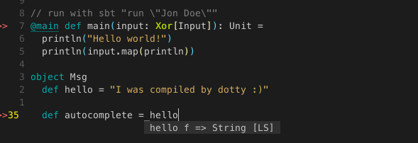
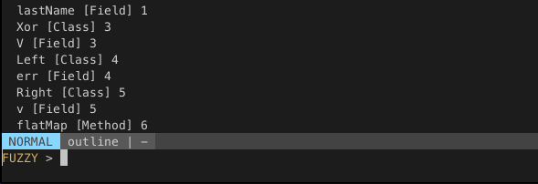
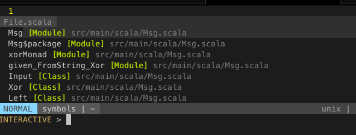
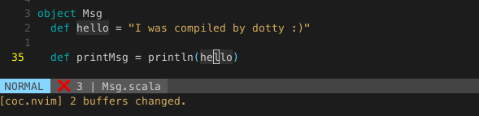
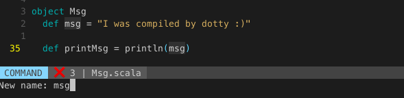
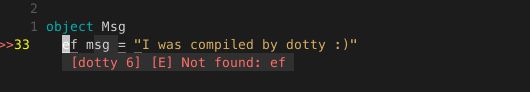
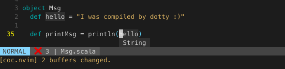

### TL;DR

1. Install [coc](https://github.com/neoclide/coc.nvim/wiki/Language-servers#scala)
2. Install [coursier](https://get-coursier.io/docs/cli-overview)
3. Remove `metals` settings from `coc-settings.json`
4. Add the `run-dotty-lsp` script given below to your path
5. Add this to your `coc-settings.json`
```
{
    "languageserver": {
        "dotty": {
          "command": "run-dotty-lsp",
            "rootPatterns": ["build.sbt"],
            "filetypes": ["scala", "sbt"]
        }
    }
}
```
6. Make sure your project compiles before first opening it with Vim

### Features

#### Autocomplete



#### Search document for symbols


#### Search across files for symbols


#### Jump to definition and to reference


#### Rename


#### Show compiler errors


#### Show type


[Dotty](http://dotty.epfl.ch/docs/index.html) comes with it's own [language server protocol](https://microsoft.github.io/language-server-protocol) implementation and you can not just use [Metals](https://github.com/scalameta/metals) to get IDE features in Vim.

In the dotty docs you find that they officially only support vscode at the moment. That's a shame, as the setup for Vim is minimal and works almost right out of the box. As I could not find any resources explaining how to make it run with my lsp client of choice for Vim, [coc vim](https://github.com/neoclide/coc.nvim) I put this post together to help the next person looking.

As shown in the dotty docs you can run `sbt launchIDE` in a dotty project (easily created with `sbt new lampepfl/dotty.g8`) to launch into vscode. But the dotty sbt plugin also offers `sbt configureIDE` and that's what we are going to use to set the project up. Furthermore you need to install [coursier](https://get-coursier.io/) to fetch the dotty lsp and run the language server.

### Setup

#### Coc

If you do not yet have coc setup for Vim, you'll need to do that. Follow the [instructions](https://github.com/neoclide/coc.nvim), but do **not** set it up for use with Scala just yet.
If you have it already running with older Scala versions, in Vim run `:CocConfig` and remove the Scala part:
```json
  "metals": {
  "command": "metals-vim",
  "rootPatterns": ["build.sbt"],
  "filetypes": ["scala", "sbt"]
}
```

This is necessary, as otherwise you would always launch `metals` when opening a dotty project and that would break everything :). 

#### Starting the language server

We can fetch and run the dotty language server with **coursier**, for that install coursier as [instructed](https://get-coursier.io/docs/cli-overview). On Mac you can run:
```zsh
$ brew tap coursier/formulas
$ brew install coursier/formulas/coursier
```

What we need to tell coursier which version of the dotty lsp it should download and run, fortunately `sbt configureIDE` provides this information for us. It creates a `.dotty-ide-artifact` file with the version. It also creates the `dotty-ide.json` file used by the language server.

To run the language server from Vim, we need to put all the needed commands in a script, make sure coursier and sbt is installed and your dotty project compiles!

```bash
#!/bin/sh
# launches the dotty language server
launch_server () {
  # reads the dotty languageserver version from the file produced with `sbt configureIDE`
  LANGUAGE_SERVER="$(cat .dotty-ide-artifact)"
  # downloads the dotty languageserver and runs it with coursier
  coursier launch "$LANGUAGE_SERVER" -M dotty.tools.languageserver.Main -- -stdio
}

# both dotty-ide and artifact file must exists
if [ ! -f ".dotty-ide.json" ] || [ ! -f ".dotty-ide-artifact" ]
then
  # if files do not exists we create them with `sbt configureIDE`
  out="$(sbt configureIDE)" 
  if [ $? -eq 0 ]
  then
    # launch server if `sbt configureIDE` was successful
    launch_server
  else
    # exit and print failure of `sbt configureIDE`, check if you program compiles
    echo "$out"
    exit 1
  fi
else
  launch_server
fi
```

It is necessary that you project **compiles** when you first open it with Vim, as otherwise `sbt configureIDE` can not be run. Only the first time you open it up though.

Put this script somewhere in you path and name it `run-dotty-lsp` and make sure you can run it with `run-dotty-lsp` inside your dotty project. To make it executable call `chmod +x run-dotty-lsp`.

#### Putting it together with coc

Now to make it work with coc run `:CocConfig` inside Vim and add dotty to you language servers.
```
{
    "languageserver": {
        "dotty": {
          "command": "run-dotty-lsp",
            "rootPatterns": ["build.sbt"],
            "filetypes": ["scala", "sbt"]
        }
    }
}
```

This tells coc to run the script when we are in a project with a `build.sbt` and have a `.scala` or `.sbt` file open.
This will now also run in normal Scala projects, so you need to manually switch between `:CocConfig` settings for Scala and Dotty projects.

Now just open up Vim in a dotty project and everything should work.
For troubleshooting you can run `:CocInfo` and `:CocOpenLog`.

#### Potential problems

* coursier intalled
* sbt installed
* project compiles
* metals lsp removed from `:CocConfig`
* after dotty version update run `sbt configureIDE` again manually
* `run-dotty-lsp` scrip can be run from dotty project
