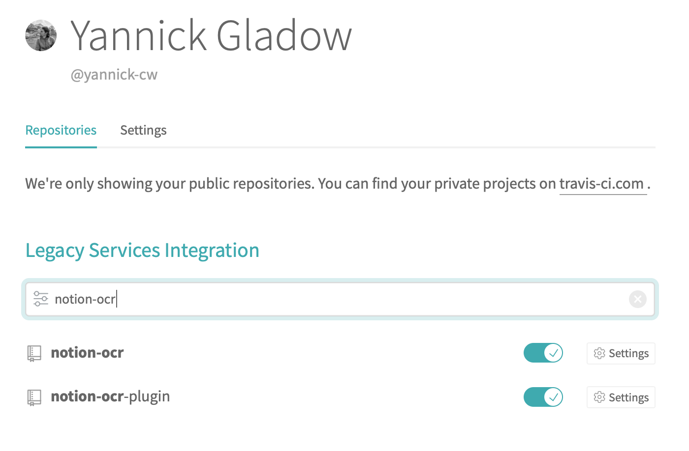

Disclaimer: I am using [stack](https://docs.haskellstack.org/en/stable/README/) to develop my Haskell projects, if you are using cabal, some things might be a little bit different.

For a project being deployed with this setup please check https://github.com/yannick-cw/notion-ocr-plugin.

It makes development very satisfying, when each push to master lands in production right away, without any further manual work needed, that's why I try to focus on continuous integration (building and running tests automatically when pushing to git) and continuous delivery (deploying the application to production when pushing to git) very early on. This makes development way faster for me in the long run, when I just quickly want to ship a small change or update.

Inspired through this [reddit](https://www.reddit.com/r/haskell/comments/7dtmha/what_is_the_easiest_way_to_deploy_haskell_code_to/) post I was looking for an easy setup to be able to ship my code for [notion-ocr](https://github.com/yannick-cw/notion-ocr) and the follow up projects to production. I did not really care to what provider, but [digitalocean](https://m.do.co/c/c6a915508afb)(referral link, gives you 100$) has a nice 5$/month virtual machine, called droplet.

Furthermore I wanted to run everything in docker, to have an easy time adding more dependencies to the docker image (e.g. in my case tesseract, an ocr tool).
Travis CI I am already used to and it is free for open source projects, so I chose that as a build server.

I am assuming a working Haskell project (built with stack) and that the project is hosted on Github.

## Building with Travis CI

First of to integrate with Travis go to https://travis-ci.org/account/repositories and enable your project:


Next we need to create a `.travis.yml` at the top level of the project.
A very simple one, that tests the build on a Linux machine could be:

```yaml
# Use new container infrastructure to enable caching
sudo: false

# Choose a build environment
dist: xenial

# Do not choose a language; we provide our own build tools.
language: generic

# Caching so the next build will be fast too.
cache:
  directories:
    - $HOME/.stack

# Ensure necessary system libraries are present
addons:
  apt:
    packages:
      - libgmp-dev

before_install:
  # Download and unpack the stack executable
  - mkdir -p ~/.local/bin
  - export PATH=$HOME/.local/bin:$PATH
  - travis_retry curl -L https://get.haskellstack.org/stable/linux-x86_64.tr.gz | tar xz --wildcards --strip-components=1 -C ~/.local/bin '*/stack'

install:
  # Build dependencies
  - stack --no-terminal --install-ghc test --only-dependencies

script:
  # Build the package, its tests, and its docs and run the tests
  - stack --no-terminal test --haddock --no-haddock-deps
```

This is mainly taken from: https://docs.haskellstack.org/en/stable/Travis_ci/

Now if we commit and push the new file, Travis should build you project.
Make sure that this works successfully, as the next steps depend on this.

## Creating the docker image

Next up we want to create a docker image which can run our Haskell project. This follows closely to the [fpcomplete](https://www.fpcomplete.com/blog/2017/12/building-haskell-apps-with-docker) tutorial.

The individual steps are easier to verify if you have docker installed, but it is not mandatory, as we want to build on our server in the end and not on the local machine.

First of we need to create a `Dockerfile`, named `Dockerfile` in our projects root.
Chose a name for your project, I go with `my-app` here in the example.

```dockerfile
FROM ubuntu:16.04
RUN mkdir -p /opt/my-app/
ARG BINARY_PATH                 # The path to our haskell binary, we provide it via ENV variable later
WORKDIR /opt/my-app
RUN apt-get update && apt-get install -y \
  ca-certificates \             # Here you could add more dependencies needed, e.g. I depend on tesseract-ocr
  libgmp-dev
ENV LANG C.UTF-8                # If you are parsing text from somewhere, this sets a locale for you and prevents weird behavior
ENV LC_ALL C.UTF-8
COPY "$BINARY_PATH" /opt/my-app # Coppying the Haskell binary
CMD ["/opt/my-app/my-app-exe"]  # my-app-exe needs to be the real name of the Haskell excecutable you are copying in
```

Basically this is a base image able to run a Haskell binary (compiled on Linux), you can add any more dependencies in the `RUN` step, if they are available with `apt`.

Now for the next step we need to pass in the binary and actually build the image. You'll need a docker account for being able to push you image to https://hub.docker.com. Any other docker repository should work as well.

We use `docker-compose` to create an image based on the `Dockerfile` above, by adding the missing binary.

Create a `docker-compose.yml` file in the toplevel of your project:

```dockerfile
version: '2'
services:
  my-app:
    build:
      context: .
      args:
        - BINARY_PATH    # We pass the binary path to the Dockerfile
    image: "dockerhub-user/my-app:${VERSION}" # Here we give the image it's name and set a Version Tag, also via an ENV variable
```

The `dockerhub-user` should be your docker.hub account's name.
Now last but not least we stitch it together, to be able to build and push the docker image.

Add a `Makefile` to the toplevel of you project:

```makefile
# Getting the version out of the package.yml file
VERSION := $(shell cat package.yaml | grep version | cut -d ' ' -f 2)

## Build the docker image
build:
	BINARY_PATH=".stack-work/dist/x86_64-linux/Cabal-2.4.0.1/build/my-app-exe/my-app-exe" VERSION=${VERSION} docker-compose build
```

One by one this does the following:

1. Get the version of your project out of the `package.yaml`, if you are not using [hpack](https://github.com/sol/hpack), adjust the code to get the version out of the `stack.yaml` or where-ever ;).

2. Getting the path to your App's executables after building with `stack build`, the path I use here is the one, that works with the `Travis` Linux machine, that builds my code.

3. running `docker-compose build` and passing in the two ENV variables

If we run `stack build && make build` on a Linux machine with Docker now it should successfully create a Docker image with our executable.

Next up we add support to push the new image to our docker.hub repository.

Therefore we need to add another step to our `Makefile:`

```makefile
release:
  	docker push dockerhub-user/my-app:${VERSION}
```

Now if you run `stack build && make build && make release` this should push the created image to your docker.hub repository.

## Pushing the docker image from Travis

But we do not want to push the image from our local machine, but from the Travis CI.
To make that work first we have to add environment variables to Travis for the docker login, if you have the [travis-ci client](https://github.com/travis-ci/travis.rb) installed it is as simple as:

```bash
travis env set DOCKER_USERNAME myusername
travis env set DOCKER_PASSWORD secretsecret
```

More information for Travis with docker you can find [here](https://docs.travis-ci.com/user/docker/).

To be able to do the `docker push` on Travis we need to login to docker, so we modify the `Makefile` and add a line for that:

```makefile
release:
  	echo ${DOCKER_PASSWORD} | docker login -u ${DOCKER_USERNAME} --password-stdin
  	docker push dockerhub-user/my-app:${VERSION}
```

And finally we modify the `travis.yml` to actually perform all the steps for creating and pushing the docker image, but **only** on master!
Add a deploy step to `travis.yml`.

```yaml
deploy:
  # Allows us to keep the binary created in the script step
  skip_cleanup: true
  provider: script
  # perform the building and pushing of the docker image
  script: make build && make release
  # only deploy on master pushes, you can add more conditionals here!
  on:
    branch: master
```

Now if we push anything to master, all steps should be executed and the newest docker image should land in your docker.hub repository.

With that we are ready to deploy that image to some infrastructure.

## Creating a digitalocean droplet

I am using digitalocean as an example here, but any VM with docker installed, and ssh access should work.
If you want to give digitalocean a try with a 100\$ starter budget, you can use my referral link: https://m.do.co/c/c6a915508afb

To create the machine we just need to create a `Droplet` with Docker from the marketplace: https://marketplace.digitalocean.com/apps/docker. Alternatively there are also instructions how to create the droplet through the API.

Follow the instructions on the droplet to be able to ssh into it.
Verify that you can ssh into your droplet and docker is running:

```bash
ssh root@your-droplet-ip
docker ps
```

## Allowing Travis to ssh into the droplet

It's good that we can ssh into the droplet, but again, we want to deploy from Travis, so Travis needs access to the droplet as well.
For that it is easiest again if we have the [Travis-ci client](https://github.com/travis-ci/travis.rb) installed.
We need to create a new ssh key, which Travis will use to ssh into the droplet:

```bash
cd your-haskell-project
ssh-keygen -t rsa -N "" -C "your-email" -f travis_rsa
travis encrypt-file travis_rsa --add # Adds a line to the .travis.yml to decrypt the key
pbcopy < travis_rsa.pub # copy the public key to your clipboard
rm travis_rsa # Make sure to remove your private ssh key, if you commit this one, game over!
rm travis_rsa.pub # Or copy this somewhere else, you have it in the clipboard, but you need the public key later!!
```

Now there should be a new line in your .travis.yml similar to:

```yaml
- openssl aes-256-cbc -K $encrypted_42c9684468b2_key -iv $encrypted_42c9684468b2_iv
    -in travis_rsa.enc -out travis_rsa -d
```

We need some more lines to handle the decrypted file on Travis correctly, add them directly below the new line:

```yaml
- openssl aes-256-cbc -K $encrypted_42c9684468b2_key -iv $encrypted_42c9684468b2_iv
    -in travis_rsa.enc -out travis_rsa -d
- eval "$(ssh-agent -s)"
- chmod 600 travis_rsa
- ssh-add travis_rsa
```

This adds the ssh key to be ready for use.

Finally push the changed `.travis.yml` and the `travis_rsa.enc`. Do **never** push the `travis_rsa` private key, as this would give anyone access to your machine.

The last step is to allow access on your droplet for the new ssh key, for that:

```bash
ssh root@your-droplet-ip

# Create the Travis user
sudo adduser --disabled-password --gecos "" travis

# Allow the Travis user do use docker without sudo
sudo usermod -aG docker travis

# Change to Travis user
sudo su travis

# Create the ~/.ssh dir and set correct permissions
mkdir ~/.ssh
chmod 700 ~/.ssh

# Create the authorized_keys file and paste the public key from earlier into it an save it
vim ~/.ssh/authorized_keys
chmod 600 ~/.ssh/authorized_keys
```

Done! Now Travis has access to the droplet.

## Deploying master on each push

Finally we want to restart with the new docker image every time we push to master, for that we add one last file to our project `deploy.sh`

```bash
#!/bin/sh

ssh -o StrictHostKeyChecking=no travis@$DIGITAL_OCEAN_IP_ADDRESS << ENDSSH
  docker stop my-app
  docker rm my-app
  docker image prune -a -f
  echo "Tag to be deployed:"
  echo $VERSION
  docker run --name my-app -p 8081:8081 -d docker.hub-user/my-app:$VERSION
ENDSSH
```

And make it executable with `chmod +x deploy.sh`.

This sends some commands to the droplet:

1. Stop the current running docker container
2. Remove the old container
3. Remove all old images
4. Start the new container, with the new `VERSION`

It needs access to the `DIGITAL_OCEAN_IP_ADDRESS`, we can set that in Travis or with:

```bash
travis env set DIGITAL_OCEAN_IP_ADDRESS droplet-ip
```

To execute this script in Travis, we add it to the Makefile's release step:

```yaml
release:
  	echo ${DOCKER_PASSWORD} | docker login -u ${DOCKER_USERNAME} --password-stdin
  	docker push dockerhub-user/my-app:${VERSION}
	  VERSION=${VERSION} ./deploy.sh
```

This passes the `VERSION` to the deploy script and runs it.

Commit these change annnnd done.

Now that's it, now on every push on master we:

1. create a new docker image (with the same tag, overwriting the old one or a new tag, if we increment the version)
2. push the image to the docker repository
3. restart the docker container on the digitalocean droplet

## Conclusion

Still maybe this is not the most easy deployment (heroku seems to be a great alternative), but it is very flexible and under our own control. I hope this helps you to get started with CI/CD of your project.

One limitation for sure is, that there is no real feedback at the moment if the deployment (the restart of the docker container on the VM) actually worked or not. For that one would need to look into the logs of Travis.
Another problem at the moment is, that there is a short time where the your container is not running, if that is an issue, you should look into rolling deployments.
