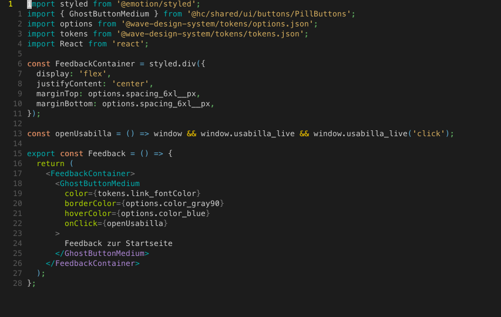

One thing I was still missing a little bit after switching from IntelliJ to Vim was being able to quickly switch
between the file I am working in and the related test file. Or, if there is no test file yet, create it easily.
In IntelliJ this is as easy as hitting `<S-CMD-t>` on mac.

With Vim we can recreate that with [vim-projectionist](https://github.com/tpope/vim-projectionist), which is a plugin to 
> "provide[s] granular project configuration".

### Setup

Add the plugin to `.vimrc` with your plugin manager or directly.

```
Plug 'tpope/vim-projectionist'
```

Add some nice shortcut to execute the `:A` alternate command.
```vim
" go test
nnoremap <Leader>gt :A<CR>
```

Add a `.projectionist.json` config file to your project root. Mine is as simple as:
```json
{
  "src/*.tsx": {
    "alternate": "src/{}.test.tsx"
  },
  "src/*.test.tsx": {
    "alternate": "src/{}.tsx"
  },
  "src/*.ts": {
    "alternate": "src/{}.test.ts"
  },
  "src/*.test.ts": {
    "alternate": "src/{}.ts"
  },
}
```

This specifies for which matching files alternates can be found, and at what path they can be found in.



keystrokes: `<leader>gt`

And if it does not exist yet, it prompts you to create the file. This works in both directions.


