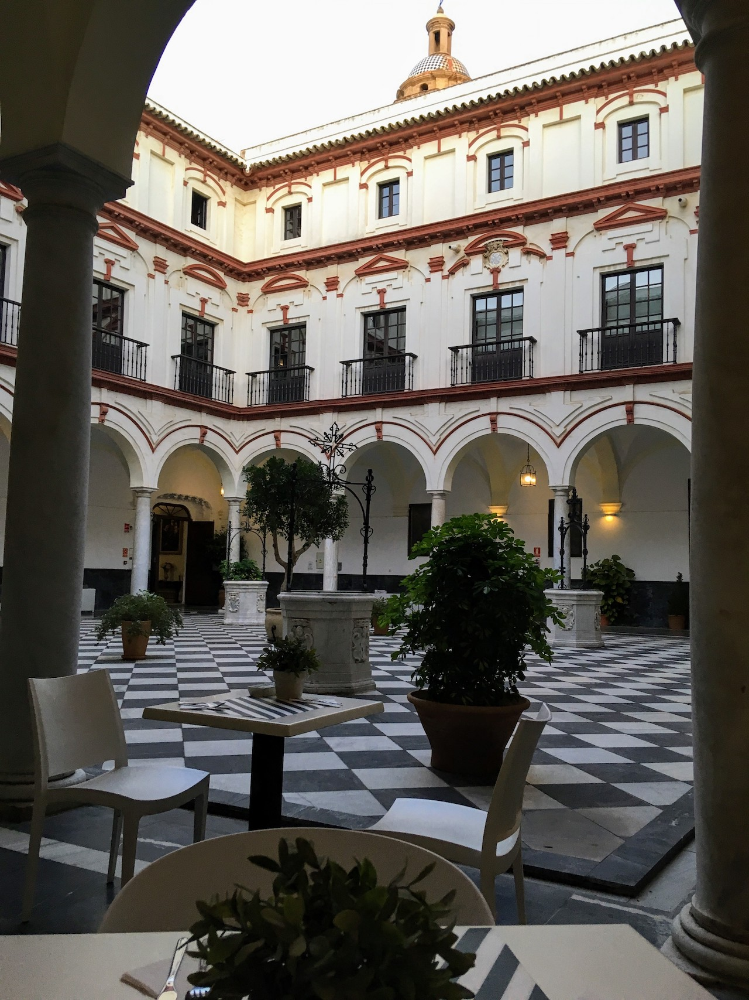
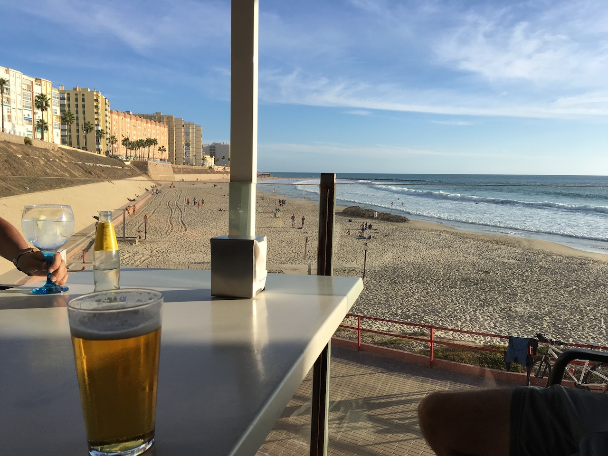
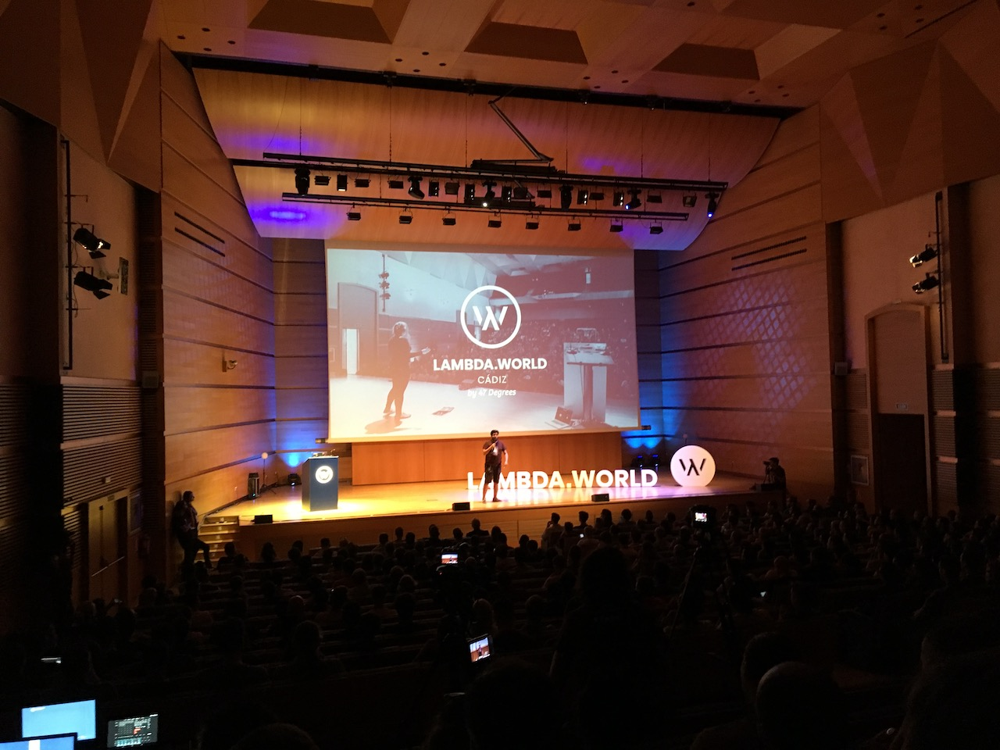
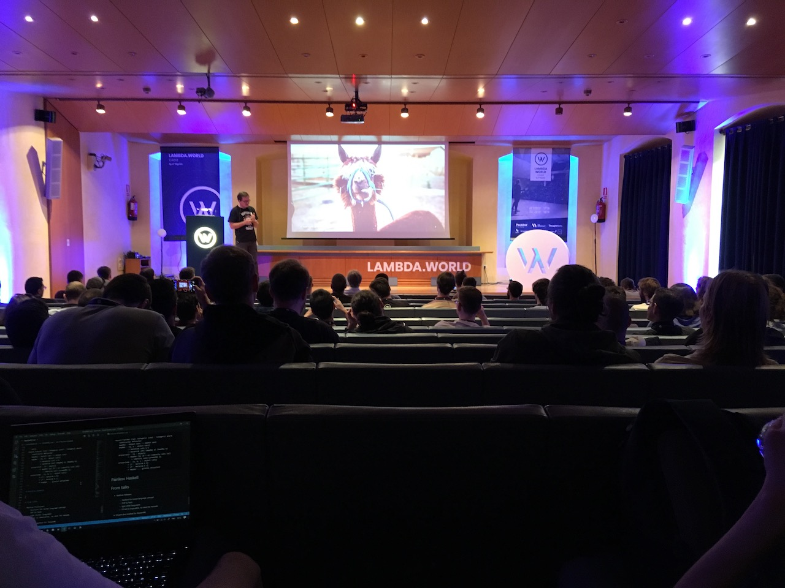
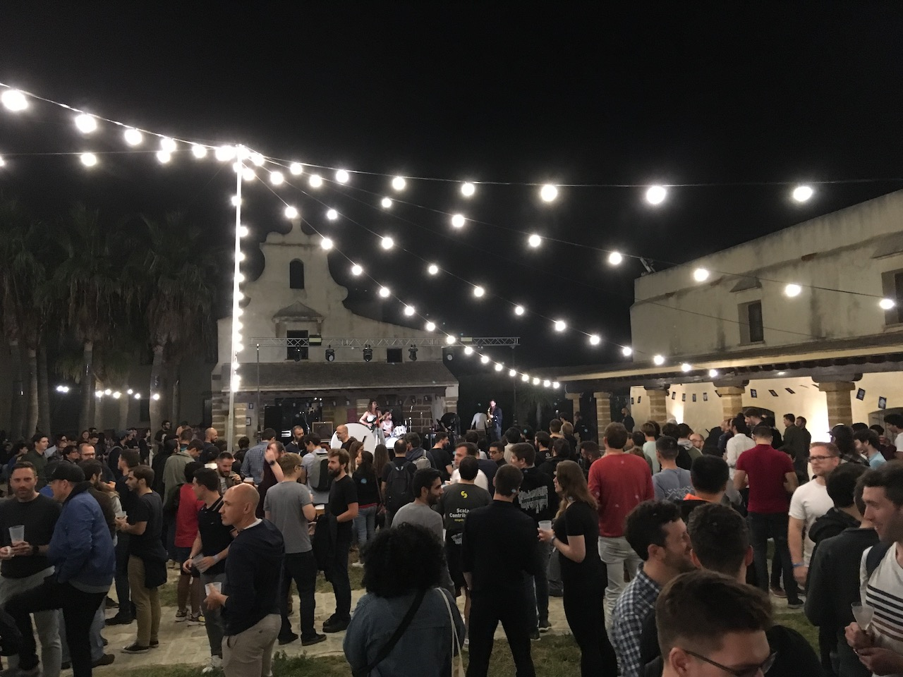

`youtube: https://www.youtube.com/embed/Tfz8dCPaObU`

This year me and eight colleagues from [holidaycheck](https://github.com/holidaycheck) went to lambda world in Cadiz.
From the amount of people going you can guess, that we really like this conference and it is already my third time there.

If you are only interested in the best talks, check the TL;DR.

### TL;DR Watch these

* [Painless software development with Haskell - Paweł Szulc](https://www.youtube.com/watch?v=idU7GdlfP9Q)
* [A Series of Unfortunate Effects - Robert M. Avram](https://www.youtube.com/watch?v=y5jZnMImbMY)
* [Functional Smart Contracts - Manuel Chakravarty](https://www.youtube.com/watch?v=7fbHdrcMsEs&t=1s)
* [Implicits Revisited - Martin Odersky](https://www.youtube.com/watch?v=uPd9kJq-Z8o)

### Getting there

Cadiz itself has no airport, but Jerez, which is less than one hour away by train, is a small airport you can fly to. Alternatively some people flew to Sevilla and took the train from there to Cadiz.
We flew from Munich, with a stop in Barcelona, to avoid the 6am direct flight. The fp-family feeling starts already on the airport, when you see the first familiar face from the last years.
Often the discussion in outside of the talks with all the awesome people are worth alone going there. But also Cadiz as location makes it easy to say yes.

### Staying there

This year I found my favorite place in Cadiz inside of the hotel we stayed in.



This colonial Spain style patio was my goto place, whenever I felt the need for some rest or for some coding. Another nice feature of the
[Hotel Convento](https://www.holidaycheck.de/hi/hotel-boutique-convento-cadiz/d5a48c7c-7080-3e85-bb9e-db08fbf4d718) is, that is right besides the conference venue and the breakfast was also great (you get also free cookie breakfast at the conference).

Also you can meet Martin Odersky there for some nice discussions about the constant audio of chanting monks in the background ;).

As Cadiz is way in the west of Europe, but still in the same timezone as Germany the sundown is pretty late (close to 8pm) and after the talks there is always time for some beer at the beach.



If you want to get some local food (we had some Spain specialists with us) you should try tapas. 

We liked [Mesón Cumbres Mayores](https://www.google.com/maps/place/Mes%C3%B3n+Cumbres+Mayores/@36.5358926,-6.2990559,17z/data=!4m5!3m4!1s0x0:0x478ff094f70cefd1!8m2!3d36.5358926!4d-6.2968672?hl=en-DE) the most, with the nice warm temperatures you can still sit outside late into the night and keep the rounds of tapas coming. Even if you do not eat meat you'll find enough great choices. And one advantage of us tourists is, that at 8pm you are almost the only one and do not have to worry about reservation, as the locals come later in the evening for food.

### The conference

#### Day 1

Lambda World seems to be growing a lot each year and the venue was packed for the unconference on Thursday morning.
Although called unconference it felt to me more like a series of lightning talks, as all of the talks where already submitted beforehand and also most of the voting had happened. Check [here](https://en.wikipedia.org/wiki/Unconference) for what I expected from an unconference.

It started right away with some nice talks, diving right fp-hardcore into some agda and idris topics. There was also one talk about [ReasonML](https://reasonml.github.io/) which made me consider again using it at work instead of typescript.



After the unconference it was workshop day, I went to the **The Ins and Outs of Generic Programming** talk by [Victor Miraldo](https://victorcmiraldo.github.io/), which was a dive into [GHC.Generics](https://wiki.haskell.org/GHC.Generics). In the end we taught the compiler how to derive Equality for any datatype.

```haskell
data BookInfo
  = BookInfo String -- ^ Name
             String -- ^ ISBN
             Float  -- ^ Price
  deriving (Show)

instance Eq' BookInfo where

test1 :: Bool
test1 =
  let bookInfo = BookInfo "Lambda World" "123" 12.5 in eq bookInfo bookInfo
```

You find the repo to the workshop [here](https://github.com/VictorCMiraldo/lw2019-generics-workshop).

The highlight of the day was the opening keynote (at the end of the day) **Implicits Revisited** by Martin Odersky, which gave a tour through the whole history of implicits and the changes coming in Dotty.
He also sneaked in indentation based syntax in Scala, which is a [controversial](https://github.com/lampepfl/dotty/issues/2491) topic in the community at the moment.

```scala
object Msg 
  def hello = "I was compiled by dotty :)"
```

You can watch the whole talk [here](https://www.youtube.com/watch?v=uPd9kJq-Z8o).

#### Day 2

Day 2 was more about talks than workshops and two really stood out to me.
If you are interested in blockchain and/or Haskell give [Functional Smart Contracts](https://www.youtube.com/watch?v=7fbHdrcMsEs) a watch. In this talk [Manuel Chakravarty](https://twitter.com/TacticalGrace) from Tweag I/O & Input Output presented how there team is working on the [Cardano](https://www.cardano.org/en/home/) blockchain and how they use Haskell to ensure a high level of safety.

Later on in the day, when everyone was already getting tired and looking forward to evening party, [Paweł Szulc](https://twitter.com/rabbitonweb) actually managed to have everyone listening to him closely presenting the [Magic of Haskell](https://www.youtube.com/watch?v=idU7GdlfP9Q), even showing slides with Alpacas to give the listeners some time to check there phones in between. Actually I think that was the only talk where no-one checked there phone ;).
He had a great energy and even better presentation skills, while introducing libraries like [Servant](https://www.servant.dev/) and [Polysemy](https://github.com/polysemy-research/polysemy), which is similar to mtl or tagless final.



Unfortunately at the same time there was the other **best** talk of the conference happening, where [Robert M. Avram](https://twitter.com/amrobert11) talked about Effects in fp languages, but in a beautiful fashion.
People came out of the talk, telling me it was the best talk they have ever seen, so make sure to [watch](https://www.youtube.com/watch?v=y5jZnMImbMY) it as well!


At the end of day 2 there is always the party at the Castillo.

.

Great live music, drinks and food served by food trucks make this a perfect opportunity to connect with the fp-family, nerd-out over monads, find new jobs or just enjoy the music and finally say goodbye until next year.

