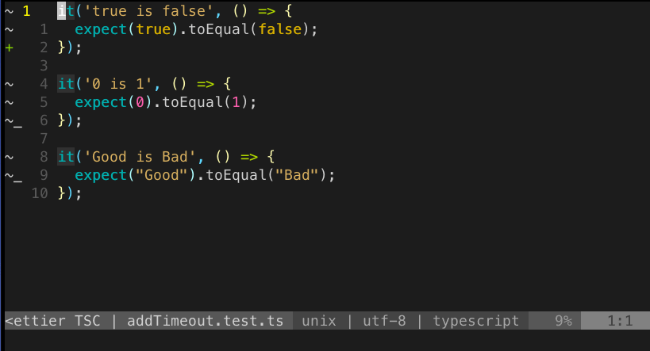
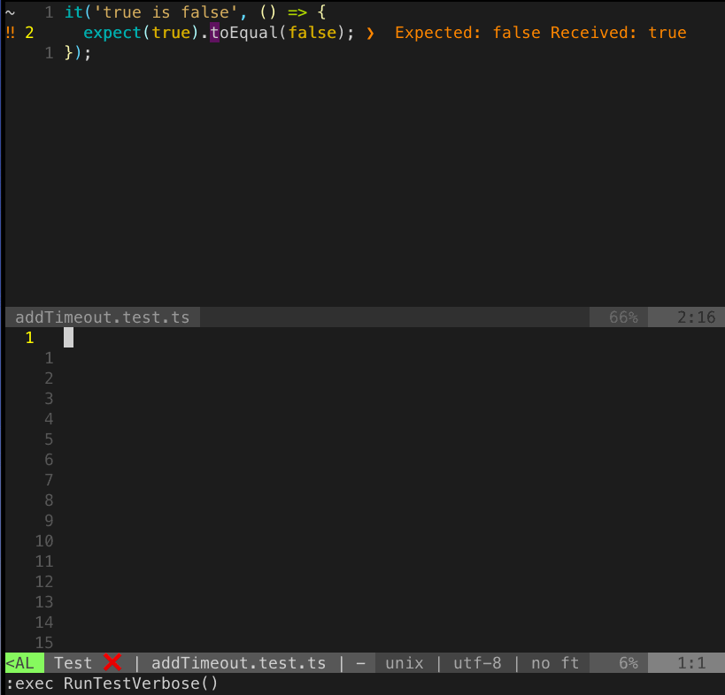

Having the test results in-line in the quickfix list (:h quickfix) can be really helpful, as it allows fast test feedback and easy navigation to the failing tests.

### Plugins used

- [vim-test](https://github.com/janko/vim-test)
- [vim-dispatch](https://github.com/tpope/vim-dispatch)
- [neomake](https://github.com/neomake/neomake)
- [vim-lightline](https://github.com/itchyny/lightline.vim) other status lines should work similar
- [jest-vim-reporter](https://www.npmjs.com/package/jest-vim-reporter)

Running all test in the file:


### Basic Setup
Add the test reporter `yarn add global jest-vim-reporter`

```vim
Plug 'janko/vim-test'
Plug 'tpope/vim-dispatch'
Plug 'neomake/neomake'
Plug 'itchyny/lightline.vim'

" use the jest-vim-reporter to shorten the jest testoutput
let g:test#javascript#jest#options = '--reporters jest-vim-reporter'
" use neomake for async running of tests
let test#strategy = "neomake"
" do not open the test run results, can be changed to show them
let g:neomake_open_list = 0
```

This setup already provides all the configuration to run the tests with e.g. `:TestNearest`, but you will not see much of the results yet and executing is also a pain, so lets add some shortcuts first.

### Key bindings

```vim
nnoremap <leader>tn :TestNearest<CR>
nnoremap <leader>tf :TestFile<CR>
nnoremap <leader>ts :TestSuite<CR>
nnoremap <leader>tl :TestLast<CR>
nnoremap <leader>tv :TestVisit<CR>
```

All commands basically do as expected, `:TestVisit` jumps to the latest run testfile from anywhere, nice.

### Showing Status in Lightline

First we add hook to listen to events from `Neomake`
```vim
augroup neomake_hook
  au!
  autocmd User NeomakeJobFinished call TestFinished()
  autocmd User NeomakeJobStarted call TestStarted()
augroup END
```

And the according functions to call when one of the hooks triggers with some nice emojis for statusline.
Depending on if the neomake job failed or succeeded we show a check mark or an error.
```vim
" initially empty status
let g:testing_status = ''

" Start test
function! TestStarted() abort
  let g:testing_status = 'Test ⌛'
endfunction

" Show message when all tests are passing
function! TestFinished() abort
  let context = g:neomake_hook_context
  if context.jobinfo.exit_code == 0
    let g:testing_status = 'Test ✅'
  endif
  if context.jobinfo.exit_code == 1
    let g:testing_status = 'Test ❌'
  endif
endfunction
```

And finally we add the status to the lightline config:
```vim
function! TestStatus() abort
  return g:testing_status
endfunction

let g:lightline = {
      \ 'colorscheme': 'wombat',
      \ 'active': {
      \   'left': [ [ 'mode', 'paste' ],
      \             [ 'cocstatus', 'teststatus', 'readonly', 'filename', 'modified' ] ]
      \ },
      \ 'component_function': {
      \   'cocstatus': 'coc#status',
      \   'teststatus': 'TestStatus'
      \ },
      \ }
```

### Jumping between Failed tests



Now that the failing tests populate our Quickfix list we can easily jump between them, even across files.
I have some key bindings to make that easier
```vim
nnoremap [q :cprevious<CR>
nnoremap ]q :cnext<CR>
nnoremap [Q :cfirst<CR>
nnoremap ]Q :clast<CR>
```

### More verbose test results

Sometimes the test output does not fit nicely into the single line and than the formatting of `jest-vim-reporter`
is very hard to read. For that I added another run mode, that is more verbose.



This is basically just running without `jest-vim-reporter` activated and another testing strategy to
be easier to inspect. Triggered with `<leader>tm`, meaning test more.

```vim
nnoremap <leader>tm :exec RunTestVerbose()<CR>

function! RunTestVerbose()
  let g:test#javascript#jest#options = '' 
  :TestNearest -strategy=neovim 
  let g:test#javascript#jest#options = '--reporters jest-vim-reporter'
endfunction
```

This just runs the nearest test, usually if I need more information on the test it is a single one,
but could be changed or extended to run any of the test commands.
