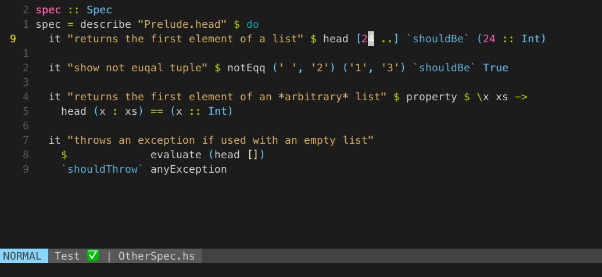

With this [commit](https://github.com/janko/vim-test/commit/c7886625ede1a3b35fafe4abb8df60db925416a1) vim-test now
allows for running test in Haskell with Stack and [HSpec](https://hspec.github.io/).

This is pretty neat as it allows to run the whole testsuite, individual files or even individual tests right from vim.

Currently this only works with stack and HSpec, but is easily extendible.

It is also possible to write failing tests directly to the quickfix list and than navigate to them.

If you want to have your testresults printed to the statusline, you can check my [post](/Running_tests_with_vim-test) on that.
