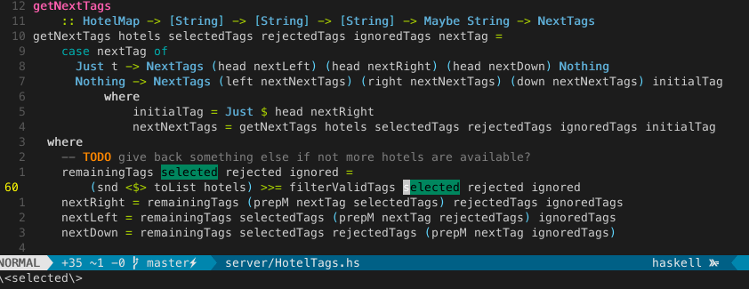
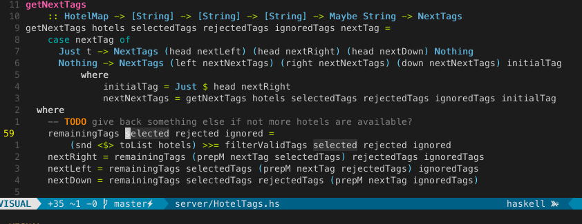

The `*` command is awesome in Vim, as it let's you search for the word currently under the cursor as in:

keystrokes: `*`

But unfortunately if you to the same on a visual selection of multiple words it searches only for the word under the cursor
as well, but not for the whole selection.

The [visual star plugin](https://github.com/bronson/vim-visual-star-search) is very nice for exactly that feature.
It allows you to search for the whole visual selection.

keystrokes: `fd;;*`

