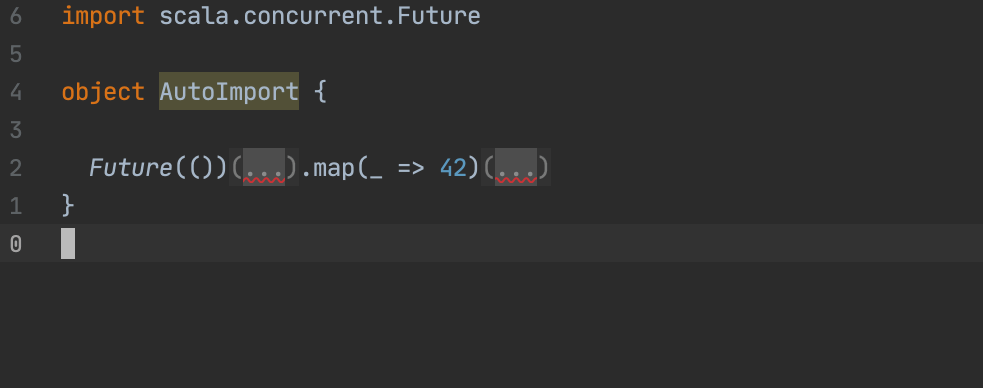
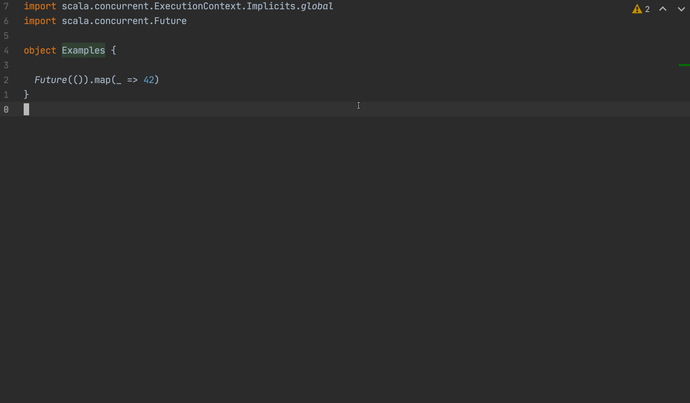
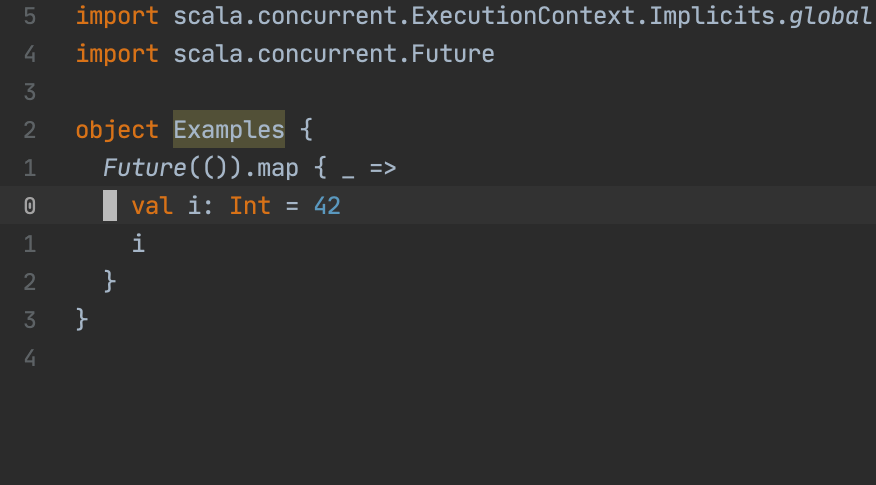
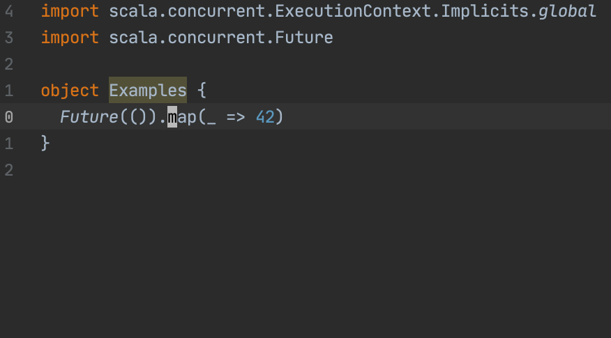
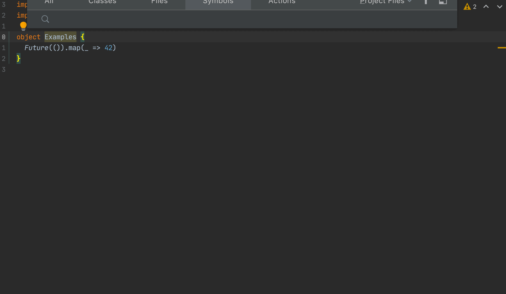

## VimtelliJ with Scala

Sometimes I am a very happy (metals) user, sometimes things just do not work out and I need to fall back to IntelliJ.
Especially bigger refactorings or renamings are super smooth in IntelliJ, on the other hand Vim with Metals feels quite mature by now and can handle most.
IntelliJ is releasing amazing features from time to time though, e.g. [auto importing implicits ](https://blog.jetbrains.com/scala/2020/07/16/intellij-scala-plugin-2020-2-auto-import-for-implicits/) is a Godsend.



This post is aimed to give some inspiration how you can set up you `.ideavimrc`.

Okay but how can we get the most out of our IntelliJ workflow? By making it like **Vim**!

But first of all: `Enter Distraction Free Mode`.
Once you get used to this, you never look back, so much nicer!

Allright, so after turning on the Vim plugin, what's next?

`:actionlist` gives a complete listing of commands that IntelliJ supports, and we can build an amazing config, that works almost like our VIM config and defines mappings for these commands.
Just create a `~/.ideavimrc` and fill it with some features.

## Here are some of my favorite features

First of we can use the [vim-surround](https://github.com/tpope/vim-surround) plugin in IntelliJ as well, a must have:

```
set surround
```

Then there is pasting from history:

```
" Pasting from yank history
nnoremap <leader>y :action PasteMultiple<CR>
```



IntelliJ's refactorings are pretty powerful, so I mapped them all out to <leader>r(efactor)<x>(what to refactor).

```
" Refactorings
nnoremap <leader>oi :action OptimizeImports<CR>
nnoremap <leader>rn :action RenameElement<CR>
nnoremap <leader>rf :action RenameFile<CR>
nnoremap <leader>ri :action Inline<CR>
nnoremap <leader>rv :action IntroduceVariable<CR>
nnoremap <leader>rm :action ExtractMethod<CR>
nnoremap <leader>rr :action Refactorings.QuickListPopupAction<CR>
nnoremap <leader>rp :action IntroduceParameter<CR>
nnoremap <leader>im :action ImplementMethods<CR>
nnoremap <leader>om :action OverrideMethods<CR>
```


Super important also the quickfix action, which opens the suggestion window from IntelliJ:

```
nnoremap <leader>qf :action ShowIntentionActions<CR>
```


And for 100% needed, formatting code:

```
nnoremap <leader>F :action ReformatCode<CR>
```

Next are the GoTo actions. All very useful, especially `ShowImplicitArguments` can be great.

```
" GoTo
nnoremap gd :action GotoDeclaration<CR>
nnoremap gr :action FindUsages<CR>
nnoremap <leader>gi :action GotoImplementation<CR>
nnoremap <leader>gs :action ActivateStructureToolWindow<CR>
nnoremap <leader>sp :action ParameterInfo<CR>
nnoremap <leader>si :action Scala.ShowImplicitArguments<CR>
nnoremap <leader>sd :action QuickImplementations<CR>
```



Well something that is constantly needed in a statically typed language like Scala is showing the type of your current selection or element under cursor:

```
" Types
nnoremap K :action Scala.TypeInfo<CR>
vmap K :action Scala.TypeInfo<CR>
```



Also mapping all the search actions helps navigating without using the mouse:

```
" Search
nnoremap <leader>fs :action GotoSymbol<CR>
nnoremap <leader>ff :action GotoFile<CR>
nnoremap <leader>fc :action GotoClass<CR>
nnoremap <leader>fa :action GotoAction<CR>
nnoremap <leader>fg :action FindInPath<CR>
nnoremap <leader>fr :action ReplaceInPath<CR>
```



Other cool stuff includes running test in every possible way right from your fingertips, consulting the undo history for older states of your file, navigating through your cursor history, through errors and vcs changes by you.

```
" Test and Run
nnoremap <leader>gt :action GotoTest<CR>
nnoremap <leader>tn :action RunClass<CR>
nnoremap <leader>tl :action Rerun<CR>
nnoremap <leader>tf :action RerunFailedTests<CR>

" Undo
nnoremap <leader>uh :action LocalHistory.ShowHistory<CR>

" Jumping
" built-in navigation to navigated items works better
nnoremap <c-o> :action Back<cr>
nnoremap <c-i> :action Forward<cr>

" Navigation
nnoremap ]c :action GotoNextError<cr>
nnoremap [c :action GotoPreviousError<cr>
nnoremap ]h :action VcsShowNextChangeMarker<cr>
nnoremap [h :action VcsShowPrevChangeMarker<cr>

```

Well that's a quick overview, finding and mapping all these actions helped me greatly to boost my productivity with IntelliJ!
There are some downsides though ;(

Downsides:

- feels a bit sluggish
- window management not like in Vim (could be solved with tmux or similar)
- when not in a file, e.g. in the file browser on the left, none of the commands are assessable

## The whole Config:

[.ideavimrc](https://gist.github.com/yannick-cw/e59a4567ffaad19359c6e8ff228d5d68)
