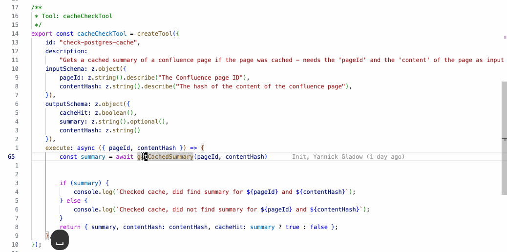
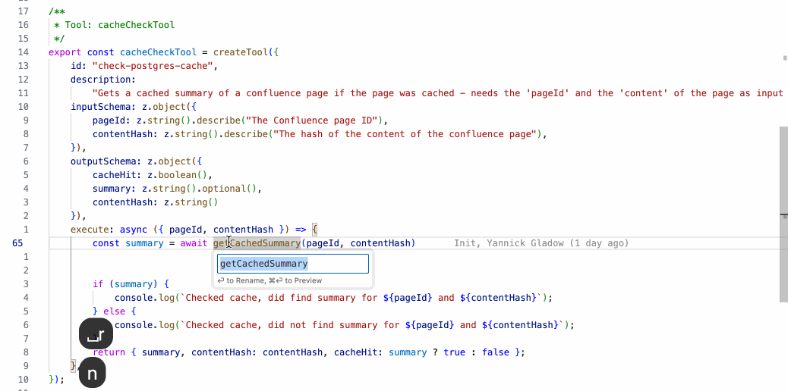

## Vursor

As I am "forced" to write less Scala and more TypeScript and I want to profit from AI assistance while still being in control and writing code myself, I am switching more and more to Cursor and away from IntelliJ. At first I did not feel at home, all my muscle memory for all the vim bindings did nothing for me. I longed to go back to IntelliJ or Vim to feel the flow. But then I realised I could just port my [VimtelliJ](/vimtellij_all_the_best_of_vim_in_intellij/) bindings to Cursor. And now all is ❤️

But first of all lets make the interface a bit nicer, hide those tabs. Once you get used to this, you never look back, so much cleaner!

```json
"workbench.editor.showTabs": "none"
```

Same as in IntelliJ I only use `shift + tab` for switching through recent files and my shortcuts, e.g. `<leader>ff` to find files by filename.

Alright, so after installing the [VSCodeVim](https://marketplace.visualstudio.com/items?itemName=vscodevim.vim) extension let's configure.

## Basic Setup

First, let's set up the essentials. Space as leader, surround plugin, highlighted yank, and some sensible search defaults:

```json
"vim.leader": "<space>",
"vim.surround": true,
"vim.highlightedyank.enable": true,
"vim.highlightedyank.duration": 200,
"vim.replaceWithRegister": true,
"vim.hlsearch": true,
"vim.incsearch": true,
"vim.ignorecase": true,
"vim.smartcase": true,
"vim.useSystemClipboard": true,
"vim.scrolloff": 3,
"vim.visualbell": true,
"editor.lineNumbers": "relative",
```

We also need to tell vim which keys it should handle vs. letting Cursor handle them:

```json
"vim.handleKeys": {
  "<C-d>": true,
  "<C-u>": true,
  "<C-f>": false,
  "<C-p>": false,
  "<C-n>": true,
}
```

## Here are some of my favorite features

### Go to Definition and Navigation

This is the most important stuff for navigation. Jump to definition, find references, peek at implementations, all without touching the mouse:

```json
{ "before": ["<leader>", "g", "d"], "commands": ["editor.action.revealDefinition"] },
{ "before": ["<leader>", "g", "r"], "commands": ["editor.action.goToReferences"] },
{ "before": ["<leader>", "g", "i"], "commands": ["editor.action.goToImplementation"] },
{ "before": ["<leader>", "g", "s"], "commands": ["workbench.action.gotoSymbol"] },
{ "before": ["<leader>", "s", "d"], "commands": ["editor.action.peekDefinition"] },
```

And to go right back (or forward again) after looking at the defintion:

```json
{ "before": ["<C-o>"], "commands": ["workbench.action.navigateBack"] },
{ "before": ["<C-i>"], "commands": ["workbench.action.navigateForward"] },
```

In the GIF below: `<space>gd` to jump to definition, then `Ctrl-o` to jump back:



### Show Type Info

One of my most used bindings. Press `K` on anything to see its type and documentation:

```json
{ "before": ["K"], "commands": ["editor.action.showHover"] },
```

This works in visual mode too, so you can select an expression and check its type.

### The cgn Workflow

This is pure vim magic and one of my absolute favorites. Want to rename something across your file without a refactoring tool?

1. Put cursor on the word
2. Press `*` to search for it
3. Press `cgn` to change the next occurrence
4. Type your replacement
5. Press `Esc`
6. Press `.` to repeat on the next occurrence, or `n` to skip

No config needed, this is built into vim. And it is faster than refactoring in many cases, as it is not realying on any structural logic in the background.

### Refactorings

Cursor's refactoring support is pretty good. I mapped them all to `<leader>r`:

```json
{ "before": ["<leader>", "r", "n"], "commands": ["editor.action.rename"] },
{ "before": ["<leader>", "r", "v"], "commands": ["editor.action.codeAction"] },
{ "before": ["<leader>", "r", "m"], "commands": ["editor.action.codeAction"] },
{ "before": ["<leader>", "r", "r"], "commands": ["editor.action.refactor"] },
{ "before": ["<leader>", "o", "i"], "commands": ["editor.action.organizeImports"] },
```

In the GIF below: `<space>rn` to rename the symbol under cursor:



### Quick Fix and Formatting

Super important, the quickfix action opens the suggestion lightbulb menu:

```json
{ "before": ["<leader>", "q", "f"], "commands": ["editor.action.quickFix"] },
{ "before": ["<leader>", "F"], "commands": ["editor.action.formatDocument"] },
```

### Search

Navigating without the mouse means having good search bindings:

```json
{ "before": ["<leader>", "f", "f"], "commands": ["workbench.action.quickOpen"] },
{ "before": ["<leader>", "f", "s"], "commands": ["workbench.action.showAllSymbols"] },
{ "before": ["<leader>", "f", "g"], "commands": ["workbench.action.findInFiles"] },
{ "before": ["<leader>", "f", "r"], "commands": ["workbench.action.replaceInFiles"] },
{ "before": ["<leader>", "f", "a"], "commands": ["workbench.action.showCommands"] },
```

### Tests

Running tests right from your fingertips:

```json
{ "before": ["<leader>", "g", "t"], "commands": ["testing.goToTest"] },
{ "before": ["<leader>", "t", "n"], "commands": ["testing.runAtCursor"] },
{ "before": ["<leader>", "t", "l"], "commands": ["testing.reRunLastRun"] },
{ "before": ["<leader>", "t", "f"], "commands": ["testing.reRunFailTests"] },
```

### Navigation through Errors and Changes

Jump between errors and git changes:

```json
{ "before": ["]", "c"], "commands": ["editor.action.marker.next"] },
{ "before": ["[", "c"], "commands": ["editor.action.marker.prev"] },
{ "before": ["]", "h"], "commands": ["workbench.action.editor.nextChange"] },
{ "before": ["[", "h"], "commands": ["workbench.action.editor.previousChange"] },
```

### Other Useful Bits

Commenting, toggling the sidebar, clearing search highlights:

```json
{ "before": ["<leader>", "c", "c"], "commands": ["editor.action.commentLine"] },
{ "before": ["<leader>", "n"], "commands": ["workbench.view.explorer"] },
{ "before": ["<leader>", "m"], "commands": ["workbench.action.toggleSidebarVisibility"] },
{ "before": ["<C-l>"], "commands": [":nohl"] },
{ "before": ["<leader>", "u", "h"], "commands": ["workbench.action.localHistory.openAll"] },
```

## Downsides

There are some things I miss compared to IntelliJ or native Vim:

- No visual star plugin, can't press `*` on a multi-word selection and then jump with `n` (need find for that: `/{words I want}` for that)
- No yank history / paste multiple - IntelliJ's `PasteMultiple` was nice
- Some minor quirks here and there

But overall, I'm pretty happy. The muscle memory is back, and I can enjoy Cursor's AI features while still feeling at home.

---

<details>
<summary><strong>Full Vim Config (click to expand)</strong></summary>

Add this to your Cursor `settings.json`:

```json
"vim.leader": "<space>",
"vim.surround": true,
"vim.highlightedyank.enable": true,
"vim.highlightedyank.duration": 200,
"vim.replaceWithRegister": true,
"vim.hlsearch": true,
"vim.incsearch": true,
"vim.ignorecase": true,
"vim.smartcase": true,
"vim.useSystemClipboard": true,
"vim.scrolloff": 3,
"vim.visualbell": true,
"editor.lineNumbers": "relative",
"vim.handleKeys": {
  "<C-d>": true,
  "<C-u>": true,
  "<C-f>": false,
  "<C-p>": false,
  "<C-n>": true
},
"vim.normalModeKeyBindingsNonRecursive": [
  { "before": ["<C-l>"], "commands": [":nohl"] },
  { "before": ["<Esc>", "<Esc>"], "commands": [":nohl"] },
  { "before": ["<leader>", "n"], "commands": ["workbench.view.explorer"] },
  { "before": ["<leader>", "m"], "commands": ["workbench.action.toggleSidebarVisibility"] },
  { "before": ["<leader>", "c", "c"], "commands": ["editor.action.commentLine"] },
  { "before": ["<leader>", "r", "n"], "commands": ["editor.action.rename"] },
  { "before": ["<leader>", "r", "v"], "commands": ["editor.action.codeAction"] },
  { "before": ["<leader>", "r", "m"], "commands": ["editor.action.codeAction"] },
  { "before": ["<leader>", "r", "r"], "commands": ["editor.action.refactor"] },
  { "before": ["<leader>", "o", "i"], "commands": ["editor.action.organizeImports"] },
  { "before": ["<leader>", "q", "f"], "commands": ["editor.action.quickFix"] },
  { "before": ["<leader>", "F"], "commands": ["editor.action.formatDocument"] },
  { "before": ["<leader>", "g", "d"], "commands": ["editor.action.revealDefinition"] },
  { "before": ["<leader>", "g", "r"], "commands": ["editor.action.goToReferences"] },
  { "before": ["<leader>", "g", "i"], "commands": ["editor.action.goToImplementation"] },
  { "before": ["<leader>", "g", "s"], "commands": ["workbench.action.gotoSymbol"] },
  { "before": ["<leader>", "s", "d"], "commands": ["editor.action.peekDefinition"] },
  { "before": ["<leader>", "s", "p"], "commands": ["editor.action.triggerParameterHints"] },
  { "before": ["<leader>", "f", "f"], "commands": ["workbench.action.quickOpen"] },
  { "before": ["<leader>", "f", "s"], "commands": ["workbench.action.showAllSymbols"] },
  { "before": ["<leader>", "f", "g"], "commands": ["workbench.action.findInFiles"] },
  { "before": ["<leader>", "f", "r"], "commands": ["workbench.action.replaceInFiles"] },
  { "before": ["<leader>", "f", "a"], "commands": ["workbench.action.showCommands"] },
  { "before": ["<leader>", "g", "t"], "commands": ["testing.goToTest"] },
  { "before": ["<leader>", "t", "n"], "commands": ["testing.runAtCursor"] },
  { "before": ["<leader>", "t", "l"], "commands": ["testing.reRunLastRun"] },
  { "before": ["<leader>", "t", "f"], "commands": ["testing.reRunFailTests"] },
  { "before": ["]", "c"], "commands": ["editor.action.marker.next"] },
  { "before": ["[", "c"], "commands": ["editor.action.marker.prev"] },
  { "before": ["]", "h"], "commands": ["workbench.action.editor.nextChange"] },
  { "before": ["[", "h"], "commands": ["workbench.action.editor.previousChange"] },
  { "before": ["<leader>", "s", "e"], "commands": ["editor.action.showHover"] },
  { "before": ["<leader>", "u", "h"], "commands": ["workbench.action.localHistory.openAll"] },
  { "before": ["<C-o>"], "commands": ["workbench.action.navigateBack"] },
  { "before": ["<C-i>"], "commands": ["workbench.action.navigateForward"] },
  { "before": ["K"], "commands": ["editor.action.showHover"] }
],
"vim.visualModeKeyBindingsNonRecursive": [
  { "before": ["<leader>", "c", "c"], "commands": ["editor.action.commentLine"] },
  { "before": ["<leader>", "c", "b"], "commands": ["editor.action.blockComment"] },
  { "before": ["<leader>", "r", "n"], "commands": ["editor.action.rename"] },
  { "before": ["<leader>", "r", "v"], "commands": ["editor.action.codeAction"] },
  { "before": ["<leader>", "r", "m"], "commands": ["editor.action.codeAction"] },
  { "before": ["<leader>", "r", "r"], "commands": ["editor.action.refactor"] },
  { "before": ["<leader>", "f", "g"], "commands": ["workbench.action.findInFiles"] },
  { "before": ["K"], "commands": ["editor.action.showHover"] }
]
```

</details>
