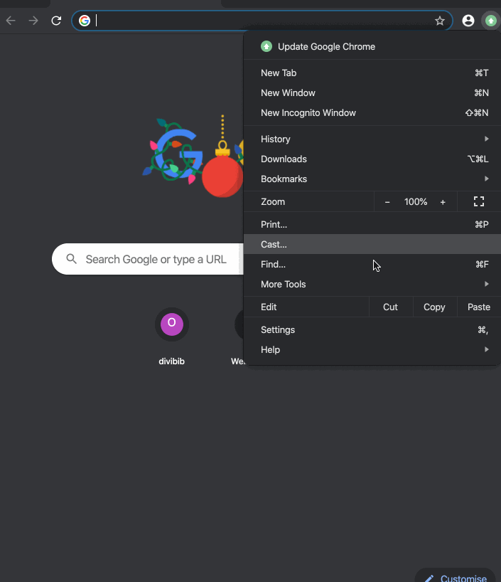
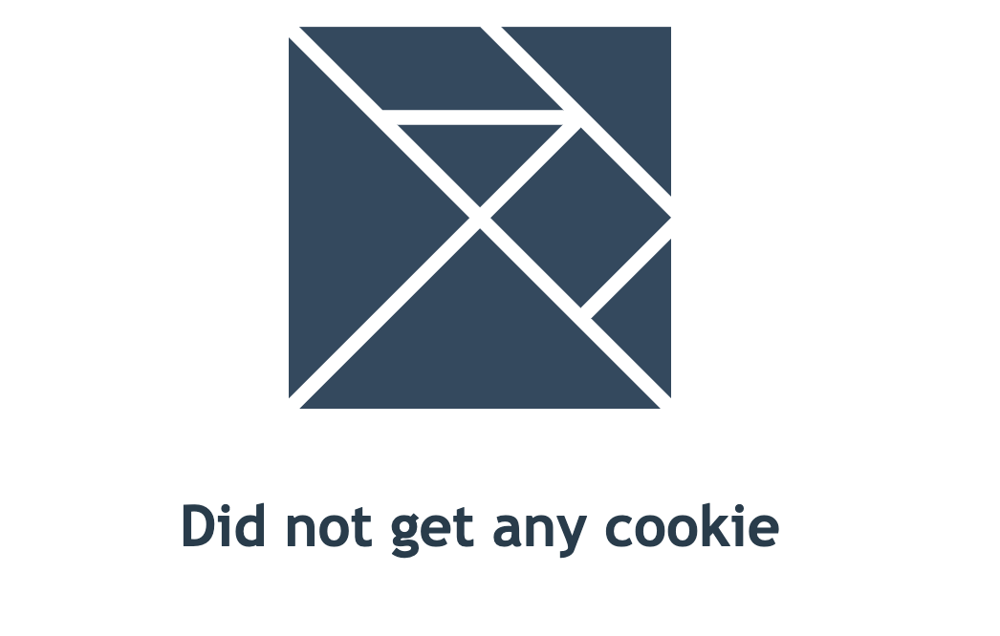
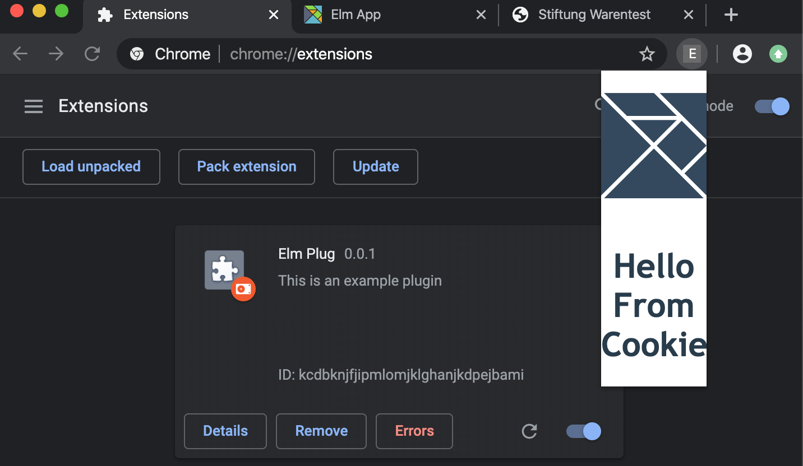

Recently I had the need to write a small browser plugin for one of my projects, the thought of that already making me feel bad thinking of needing to program in Javascript again 😱.
But then my fear turned to joy, when I realized this is a perfect opportunity to write the plugin in Elm, my favorite language for the frontend.
[Elm](https://elm-lang.org) is a beautiful language, with a similar feel to Haskell, it gives some benefits as:

- No Runtime Exceptions
- Great Performance
- Functional to its core
- Great Error Messages / Compiler
- The Elm Architecture

Check out a nice introduction here:
`youtube: https://www.youtube.com/embed/oYk8CKH7OhE`

You can find the whole code for this example here: https://github.com/yannick-cw/elm-example-chrome-plugin

#### Setting up the project

We will create the Elm project with [create-elm-app](https://github.com/halfzebra/create-elm-app), as it makes developing pretty comfortable and easy.

Run `create-elm-app elm-plug` and `cd elm-plug` afterwards. To verify all is working run `elm-app start` and you should see your elm app running on `http://localhost:3000`.

You should have a structure like that now:

```
elm-plug
│   README.md
│   elm.json
│   .gitignore
│
└───public
│
└───src
│
└───tests
```

Now are able to run `elm-app build`, which generates the production build for us in `build/` and `build/static/`.

#### Setup for the Plugin

Next we need to add a `manifest.json` file under `public/manifiest.json`. There is already one in there, but we replace it with a new, as we need a different setup for using our app as a plugin.

```json
{
  "manifest_version": 2,

  "name": "Elm Plug",
  "description": "This is an example plugin",
  "version": "0.0.1",

  "browser_action": {
    "default_popup": "index.html"
  },

  "permissions": ["cookies", "http://www.test.de/"]
}
```

One important part here is to tell the browser which file to load initially with `browser_action.default_popup` and to get permission, if you want to access anything from the [Extensions Api](https://developer.chrome.com/extensions/api_index). As we want to read some cookies later, we can already add that here. We also add an url to specify which hosts we can access, e.g. read cookies from.

Next it's time to add our plugin to the browser and see it in action.

#### Enabling the Plugin

We have to run `elm-app build` again, to build with our new `manifest.json` and have the `build` directory ready.

Now we need to load the `build` directory as an unpacked chrome plugin, as shown in the gif:


Great now we already have our Elm application running as a plugin. What else do we need?
Access to the [Extensions Api](https://developer.chrome.com/extensions/api_index) would be great, to interact with the browser outside of the plugin.

#### Using Ports to access the Plugin API

To access anything outside of our save Elm world, we need to use [Ports](https://guide.elm-lang.org/interop/ports.html), they are our way how to interact asynchronously with JS. There is no synchronous way to directly interact with anything from the outside, as this could risk our no runtime exceptions guarantees.
I will not go into detail here how ports work, check the nice [docs](https://guide.elm-lang.org/interop/ports.html) for more information.

We need to create a new file `Ports.elm`:

```Elm
port module Ports exposing (askCookie, updateCookie, CookieValue)


type alias CookieValue =
    String


type alias CookieName =
    String


port updateCookie : (Maybe CookieValue -> msg) -> Sub msg


port askCookie : CookieName -> Cmd msg
```

Important here is to add the `port` in front of the `module` declaration.

We added two functions here, the `askCookie` can be used to send something to the outside world and `updateCookie` can be used to receive something from the outside world.
What `askCookie` does not do, is returning a resulting `CookieValue` in any way. It is just an asynchronous message to the outside, triggering some action.

As we can never rely on the JS code from outside, we can only ever expect to `Maybe` receive an `CookieValue`. To use `updateCookie` we need to provide a function that creates a message from the `CookieValue` we get back.

Lets use our ports in out `Main.elm`:

We add `import Ports exposing (askCookie, updateCookie, CookieValue)` to the imports and send the `askCookie` event when the plugin is opened:

```elm
type alias Model =
    Maybe CookieValue

init : ( Model, Cmd Msg )
init =
    ( Nothing, askCookie "some_cookie" )
```

Next we need to make sure we listen to the cookies coming in through `updateCookie`:
For that we add a new `Msg`, fulfilling exactly the parameter of our `updateCookie` function (`Maybe CookieValye -> msg`).

```elm
type Msg
    = GotCookie (Maybe CookieValue)
```

Than we add a subscription to `updateCookie`:

```elm
main : Program () Model Msg
main =
    Browser.element
        { view = view
        , init = \_ -> init
        , update = update
        , subscriptions = \_ -> updateCookie GotCookie -- listen to updates
        }
```

And finally react to received updates of the cookie:

```elm
update : Msg -> Model -> ( Model, Cmd Msg )
update msg model =
    case msg of
        GotCookie maybeCookie ->
            ( maybeCookie, Cmd.none )
```

Now we can display the cookie value:

```elm
view : Model -> Html Msg
view model =
    let
        cookieText =
            case model of
                Just c ->
                    text c

                Nothing ->
                    text "Did not get any cookie"
    in
    div []
        [ img [ src "/logo.svg" ] []
        , h1 [] [ cookieText ]
        ]
```

And we get


Lastly we need to add some javascript to actually read the cookie from the browser. Therefore we change the `src/index.js` file:

```javascript
import './main.css'
import { Elm } from './Main.elm'
import * as serviceWorker from './serviceWorker'

const app = Elm.Main.init({
  node: document.getElementById('root')
})

const updateCookie = cookieName => {
  if (chrome && chrome.cookies) {
    chrome.cookies.get(
      { url: 'https://www.test.de/', name: cookieName },
      function(cookie) {
        if (cookie) {
          app.ports.updateCookie.send(cookie.value)
        } else {
          app.ports.updateCookie.send(null)
        }
      }
    )
  }
}

app.ports.askCookie.subscribe(updateCookie)

// If you want your app to work offline and load faster, you can change
// unregister() to register() below. Note this comes with some pitfalls.
// Learn more about service workers: https://bit.ly/CRA-PWA
serviceWorker.unregister()
```

This subscribes to the `askCookie` messages and runs the `updateCookie` function, whenever there is a new message from `aksCookie`.
In the `updateCookie` function we try to access the cookies for `www.test.de` and the given name. This cookie we send asynchronously back to our Elm App with `updateCookie.send`. If we send `null`, in the case that we do not find a cookie, we will receive `Nothing` inside our Elm App.

If you now have a cookie set for `www.test.de` with the name `"some_cookie"` this should now show up, when you open the plugin.



#### Mock for Dev

One last thing, to make development easier and faster, is to mock the `chrome.cookies` access, so you can see the Elm App behaviour without running `elm-app build` every time you haven changes. E.g. add this to the `index.js`:

```javascript
const updateCookie = cookieName => {
  if (chrome && chrome.cookies) {
    chrome.cookies.get(
      { url: 'https://www.test.de/', name: cookieName },
      function(cookie) {
        if (cookie) {
          app.ports.updateCookie.send(cookie.value)
        } else {
          app.ports.updateCookie.send(null)
        }
      }
    )
  } else {
    app.ports.updateCookie.send('dev_cookie')
  }
}
```

Now you can just develop with having `elm-app start` running and inspecting the page in the browser directly, instead of only in the plugin window.


Thats all to get started building plugins with Elm.
