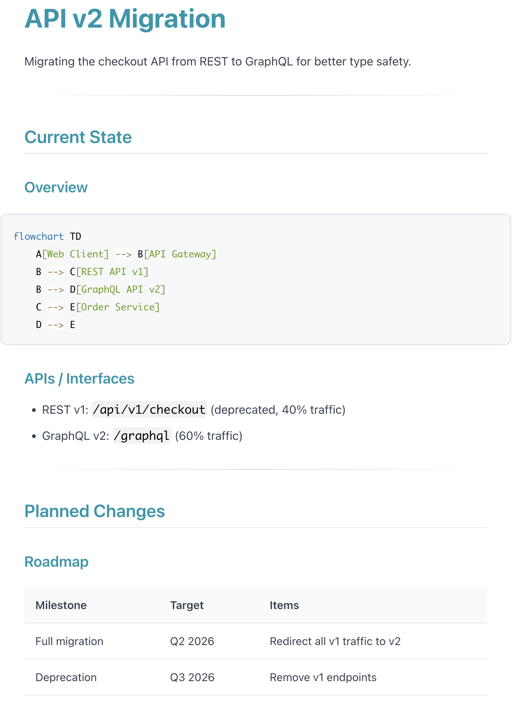

I already showed in [my previous post about organizing with Obsidian](/obsidian/) that I'm a really big fan of doing everything in Obsidian. Now with the power of AI, I could take project management one step further: **project organisation**.

I created a new skill called **obsidian-project**. This skill and this project organisation approach solves the problem for me of always having an **up-to-date picture of the project I'm working on and at the same time showing me how it evolved over time and which decisions were taken.** This was the one thing I was still missing up to now because the manual integration work was just too much.

### Project Structure

Each project lives in a folder with this structure:

```
my-project/
├── CLAUDE.md          # Agent context
├── CLICK.md           # Weekly sync instructions
├── summary.md         # The always-up-to-date summary
├── brainstorming.md   # Personal scratchpad (not synced)
└── inbox/
    ├── inbox.md       # Running inbox (timestamped)
    └── [*.md]         # Dropped documents
```

The `CLAUDE.md` file serves a dual purpose: it configures the project settings (like Confluence page ID), but it also gives any AI working in this folder a quick start. When Claude opens a project folder, it reads this file to understand what the project is about and how to work with it.

## The Inbox

As with [my todo approach](/obsidian/), I wanted to have the same easy way during the day, during work, during any thoughts that pop up, to just dump data into it. That's why I have the inbox folder.

In the inbox folder I can throw random files or random timestamped notes. For example a note saying "we changed that name from X to Y because it sounds better."


## The Summary

Now the core flow is that I have a summary document in this project that shows me the latest up-to-date summary.

I generally structure the summary document in the following way:

| Section | Purpose |
|---------|---------|
| **Current State** | What's currently the state and being worked on, the progress on that, usually with a nice overview diagram, maybe some entity relationship diagrams |
| **Planned Next** | What's planned next, maybe this is then going to general availability with the feature, for example |
| **History** | What's in the past and what's rejected |
| **Changelog** | Always there so you can see what has changed for what reason |
| **References** | The linked resources |

Here's an example of what a summary might look like:



## Keeping It Up-to-Date Effortlessly

How do I keep this up-to-date effortlessly? Well, I use my other skill [Click](/click_recurring_tasks_for_claude/) which is used to update this once a week.

What does it do? It reads everything that is new in the inbox, processes it with user consent, integrates it into the summary, and then moves the inbox part to processed. It can also delete it or move it into the project depending on the type of input.

```
$ claude
> run clicks

Running click: API v2 Migration (weekly)

Reading inbox...
  - inbox.md: 2 new entries
  - performance-report.md: 1 document

Proposed changes to summary.md:

  Current State > APIs / Interfaces:
  + Added: "Response times improved 40% after caching layer"

  History > Completed:
  + | 2026-02-03 | Caching layer deployed | See performance-report.md |

  Changelog:
  + - 2026-02-03: Added caching deployment to completed items

Apply these changes? [y/n]: y

Changes applied.

What to do with inbox/performance-report.md?
  [a] Archive to processed/  [d] Delete  [k] Keep at project root
> a

Moved to inbox/processed/performance-report.md
Cleared inbox/inbox.md entries.

Push to Confluence? [y/n]: y
Pushed to Confluence. Last synced: 2026-02-03
```

That way I always have an up-to-date summary of the project with all decisions taken.

## Setting Up a New Project

The skill also can create a new project. Running `setup project` will ask you to provide all the input and then go through all the input and ask you how to integrate it into the summary.

You also can manually give structure to the summary ahead of time. That's a specific step for that. This is important: before AI fills in any content, you edit `summary.md` to add your preferred sections. This way you own the structure, not the AI.

The setup flow:

1. **Basic info**: Project name, location, description
2. **Confluence**: Optional page URL for sharing  
3. **Existing inputs**: Any documents or context to include initially
4. **Manual structure**: You edit the summary to add your preferred sections first
5. **Initial generation**: AI fills in content around your structure
6. **Click registration**: Automatically adds weekly sync

## Sharing via Confluence

As a bonus, and it's also included in this weekly sync: if this is a shared project, I have it integrated so it can push this nicely to Confluence including the Mermaid diagrams.

So on Confluence I have a read-only version of this page. I'm not editing Confluence, it also always shows the most up-to-date project summary meaning everyone can benefit who's working on the project.


## Conclusion

I think this really shows the benefit of AI. This manual integration across my projects every few days or every week would be a significant amount of work that I wasn't willing to do. But now that this work becomes almost free, I just have to interactively review, it makes it a perfect tool to keep up-to-date.

## Commands Reference

| Command | What it does |
|---------|--------------|
| `setup project` | Create new project with gathering phase |
| `update project` | Sync inbox to summary (usually via click) |

---

<details>
<summary><strong>Full Skill File (click to expand)</strong></summary>

Save this as `~/.claude/skills/obsidian-project/SKILL.md`:

```markdown
---
name: obsidian-project
description: "Use when setting up a new project for knowledge management, or when syncing a project inbox to its summary. Commands: setup project, update project."
---

# Obsidian Project - Knowledge Management for Ongoing Projects

## Overview

Manages ongoing projects with always-up-to-date summaries, easy input via inbox, weekly syncs, and optional Confluence publishing.

## Commands

| Command | Description |
|---------|-------------|
| `setup project` | Create new project with gathering phase |
| `update project` | Sync inbox to summary (usually via click) |

## Project Structure

my-project/
├── CLAUDE.md          # Agent context (you are here)
├── CLICK.md           # Weekly sync instructions
├── summary.md         # Shareable summary
├── brainstorming.md   # Personal scratchpad (not synced)
└── inbox/
    ├── inbox.md       # Running inbox (timestamped)
    └── [*.md]         # Dropped documents

## Design Principles

| Principle | Behavior |
|-----------|----------|
| Inbox format | Auto-timestamped entries |
| Diagrams | Mermaid only (portable to Confluence) |
| Links | Markdown `[text](url)` - no internal wikilinks |
| Sync | Weekly click, draft + review before applying |
| Agent edits | Can edit summary directly with confirmation |
| Rejection reasoning | Include only if explicitly provided, never fabricate |

---

## Command: `setup project`

### Flow

1. **Gather basic info**
   - Ask: Project name
   - Ask: Location (folder path in vault)
   - Ask: Brief description

2. **Confluence configuration**
   - Ask: Confluence page URL (optional, can be "none")
   - If provided, extract page ID from URL

3. **Create folder structure**
   - Create project folder at specified location
   - Create `inbox/` subfolder
   - Copy templates: CLAUDE.md, CLICK.md, summary.md, inbox/inbox.md
   - Fill in project-specific values in templates

4. **Gather existing inputs**
   - Ask: "What existing documents, links, or context should be included?"
   - User provides: file paths, URLs, paste text
   - Read and analyze all provided inputs

5. **Manual structure phase**
   - Tell user: "Edit summary.md now to add your preferred structure/sections. Say 'continue' when ready."
   - Wait for user to confirm
   - This allows user to scaffold the document before AI fills content

6. **Generate initial summary**
   - Read the current summary.md (with user's structure)
   - Fill in content around user's structure based on gathered inputs
   - Preserve user's custom sections
   - Show proposed summary to user for approval

7. **Clear processed inbox**
   - After summary is approved, clear inbox/inbox.md content (keep file with header)
   - For each document in inbox/, ask user to choose disposition:
     - **Archive** (default): Move to `inbox/processed/`
     - **Delete**: Remove the file
     - **Keep at top level**: Move to project root (for important docs like sub-RFCs)
   - This prevents re-processing during first sync

8. **Register click**
   - Add entry to ~/.clicks.md Active table:
     - Path: /absolute/path/to/project/CLICK.md
     - Frequency: weekly
     - Last Run: -
     - TTL Expires: 6 months from now
     - Status: ok

9. **QuickAdd setup (first time)**
   - If no "Add to Project Inbox" QuickAdd exists, offer to set it up
   - Provide instructions for Obsidian QuickAdd configuration

---

## Command: `update project`

Usually triggered by weekly click, can also run manually.

### Flow

1. **Read inbox**
   - Read `inbox/inbox.md`
   - Read any additional `.md` files in `inbox/` folder
   - Parse timestamped entries

2. **Read current summary**
   - Read `summary.md`
   - Understand current state, planned changes, history

3. **Analyze changes**
   - Identify new state changes (things that now exist)
   - Identify new planned items (future work)
   - Identify completed items (move from Planned to History)
   - Identify rejected decisions (add to History with reasoning IF provided)

4. **Generate proposed updates**
   - Draft updates to each section as needed
   - Create changelog entries with dates
   - Format: `- YYYY-MM-DD: [description of change]`

5. **Show diff for approval**
   - Present proposed changes clearly
   - Ask user to approve, modify, or reject

6. **Apply changes**
   - Update summary.md with approved changes
   - Clear inbox/inbox.md (keep file with header, remove entries)
   - For each document in inbox/, ask user to choose disposition:
     - **Archive** (default): Move to `inbox/processed/`
     - **Delete**: Remove the file
     - **Keep at top level**: Move to project root (for important docs like sub-RFCs)

7. **Confluence push (if configured)**
   - Check CLAUDE.md for Confluence config
   - If configured, ask: "Push to Confluence?"
   - If yes: use Confluence MCP to update the page with summary.md content
   - Update "Last synced" date in CLAUDE.md
```

</details>

<details>
<summary><strong>Summary Template (click to expand)</strong></summary>

```markdown
# {{PROJECT_NAME}}

{{PROJECT_DESCRIPTION}}

---

## Current State

<!-- What exists now: architecture, APIs, components, configurations -->

### Overview

flowchart TD
    A[Component] --> B[Component]

### APIs / Interfaces

<!-- Document current APIs, endpoints, contracts -->

---

## Planned Changes

<!-- Future work, milestones, roadmap items -->


### Roadmap

| Milestone | Target | Items |
|-----------|--------|-------|

---

## History

<!-- Completed items and rejected decisions -->

### Completed

| Date | Item | Notes |
|------|------|-------|

### Rejected

| Date | Decision | Reason |
|------|----------|--------|

---

## Changelog

<!-- Dated entries of document changes -->

- {{TODAY}}: Initial project setup

---

## References

<!-- External links only - no internal wikilinks -->

| Resource | Link |
|----------|------|
```

</details>

<details>
<summary><strong>Mermaid Conversion Script (click to expand)</strong></summary>

Save as `~/.claude/skills/obsidian-project/mermaid_to_url.py`:

```python
#!/usr/bin/env python3
"""Convert Mermaid diagram to mermaid.ink URL using pako compression."""

import sys
import json
import zlib
import base64

def mermaid_to_url(mermaid_code: str) -> str:
    payload = json.dumps({
        "code": mermaid_code,
        "mermaid": '{"theme": "default"}',
        "updateEditor": True,
        "autoSync": True,
        "updateDiagram": True
    })
    compressed = zlib.compress(payload.encode(), level=9)
    encoded = base64.urlsafe_b64encode(compressed).decode().rstrip('=')
    return f"https://mermaid.ink/img/pako:{encoded}"

if __name__ == "__main__":
    if len(sys.argv) > 1:
        code = sys.argv[1].replace('\\n', '\n')
    else:
        code = sys.stdin.read()
    print(mermaid_to_url(code.strip()))
```

</details>
