AI is changing the whole coding workflow fundamentally, code is produced faster than ever. But with that comes a new challenge, the review burden.
We, as humans, are still needed for now to verify. This means more and more PRs to review every week. 
Facing this myself I looked for a way to make this activity a bit easier. 
Especially figuring out where to start and in what order to go through a PR seemed to be something that could be optimized. 

I'm already seeing teams removing humans from the review process or having AI do the review for you, and this really makes me uncomfortable. I think right now the human reviewer is super important.
This skill helps with what AI is pretty good at the moment: making our life easier by providing information while not replacing what we are doing.

For that I created a small skill: **PR Review Navigator**, ask Claude to help you get oriented, and it generates a dependency diagram plus a suggested file order. You still do all the actual reviewing.

## Usage

Give Claude a PR number:

```
> /pr-review-navigator 19640
```

It'll create for you:

1. **One-sentence summary**: just facts, no interpretation
2. **Mermaid diagram**: files as nodes, arrows showing dependencies, numbered review order, test file relation shown
3. **Review table**: suggested order with links to each file, you can jump in right away

## Example

Here's what you get for a PR that adds a user notification feature:

## AI Review Navigator

**Summary:** Adds `Notification` entity with repository, service, and REST controller, plus a `NotificationListener` for async delivery.


### File Relationships & Review Order

```mermaid
flowchart TB
    subgraph "1️⃣ API Layer"
        A["① NotificationController.scala<br/><i>REST endpoints</i>"]
    end
    
    subgraph "2️⃣ Service Layer"
        B["② NotificationService.scala<br/><i>Business logic</i>"]
        C["③ NotificationListener.scala<br/><i>Async event handler</i>"]
    end
    
    subgraph "3️⃣ Repository Layer"
        D["④ NotificationRepository.scala<br/><i>CRUD operations</i>"]
    end
    
    subgraph "4️⃣ Model Layer"
        E["⑤ Notification.scala<br/><i>Entity definition</i>"]
        F["⑥ NotificationEvent.scala<br/><i>Domain events</i>"]
    end
    
    subgraph "5️⃣ Tests"
        T1["⑦ NotificationServiceSpec.scala"]
        T2["⑧ NotificationRepositorySpec.scala"]
    end
    
    A --> B
    B --> D
    B --> C
    C --> D
    D --> E
    C --> F
    
    B -.->|tested by| T1
    D -.->|tested by| T2
    
    style T1 fill:#e8f5e9
    style T2 fill:#e8f5e9
```




### Suggested Review Order

| # | File | What it does | Link |
|---|------|--------------|------|
| 1 | `NotificationController.scala` | REST endpoints for creating and listing notifications | [View](#) |
| 2 | `NotificationService.scala` | Orchestrates notification creation and delivery | [View](#) |
| 3 | `NotificationListener.scala` | Handles async notification events from queue | [View](#) |
| 4 | `NotificationRepository.scala` | MongoDB operations for notifications | [View](#) |
| 5 | `Notification.scala` | Defines Notification entity with status enum | [View](#) |
| 6 | `NotificationEvent.scala` | Domain events for notification lifecycle | [View](#) |
| 7 | `NotificationServiceSpec.scala` | Tests service layer logic | [View](#) |
| 8 | `NotificationRepositorySpec.scala` | Tests repository CRUD operations | [View](#) |

## Core Ideas

The skill has some constraints:
- **Read-only**: it cannot comment, approve, or modify anything
- **No judgment**: phrases like "well-designed" or "optimized for" are forbidden, this is up to you :)
- **Facts only**: "Adds X with Y" not "Improves performance by adding X", the llm might have no clue about the domain and the business logic behind the change

The AI describes what changed. You decide if it's good.

## Review Order Logic

The suggested order follows an outside-in approach, like peeling an onion:
1. API layer first (controllers, endpoints)
2. Then services (business logic)
3. Then repositories (persistence)
4. Then models/entities (core data)
5. Tests after the code they test


This mirrors how a request flows through the system. You see the entry point first, then follow the call chain inward.

For sure only if your project is modelled like this :)


<details>
<summary><strong>Full Skill File (click to expand)</strong></summary>

Save this as `~/.cursor/skills/pr-review-navigator/SKILL.md`:

````markdown
---
name: PR Review Navigator
description: This skill should be used when the user asks to "review a PR", "analyze a pull request", "help me review PR", "navigate a PR", "understand this PR", or provides a PR number or URL for review orientation. Generates AI-assisted navigation aids to help humans start reviewing a pull request more efficiently.
---

# PR Review Navigator

This skill generates navigation aids to help humans review pull requests more efficiently. It provides orientation and structure - not pre-review or judgment.

**Important constraints:**
- Read-only access to GitHub (no writing, commenting, or approving)
- Output is displayed in the conversation or written to a local file if specified
- No interpretation of business intent or purpose - only factual descriptions of what changed

## When to Use

Use this skill when a user wants help getting started with reviewing a pull request. The skill provides structure and orientation to make the human review process easier.

## Output Format

**Always write output to a markdown file.** The console does not preserve markdown formatting correctly (backticks get stripped). Write to a file in the workspace, defaulting to `pr-review-navigator.md` in the current directory or a location specified by the user.

After writing the file, inform the user of the file path so they can open it and copy-paste the content.

The file content should be valid markdown that can be directly pasted into a GitHub PR comment or description. Wrap the mermaid diagram in triple backticks with `mermaid` language tag.

Generate the following sections:

### 1. AI Review Navigator (Header)

Use this exact header to indicate the content is AI-generated review assistance.

### 2. One-Sentence Summary

A single factual sentence describing what was added/changed/removed. 

**Rules:**
- State only facts about what changed (files added, entities introduced, modifications made)
- Do NOT interpret purpose, intent, or business value
- Do NOT use phrases like "optimized for", "designed to", "intended for"
- Example: "Adds `VariantProjection` entity with repository, view, update service, and event listener, plus helper methods on `Product` and `VariantView`."

### 3. Mermaid Diagram

Create a flowchart showing:
- All changed files as nodes
- Dependency relationships between files (arrows showing "depends on" or "uses")
- Numbered circles indicating suggested review order
- Color coding: implementation files vs unit tests vs integration tests
- Groupings by architectural layer (subgraphs)
- Test files connected to the implementation files they test

**Diagram guidelines:**
- Use `flowchart TB` (top to bottom)
- Number nodes with circled numbers: ①, ②, ③, etc.
- Use subgraphs to group by architectural layer (outside-in order):
  1. API Layer (HTTP routes, GraphQL, controllers)
  2. Service Layer (business logic)
  3. Repository/Persistence Layer
  4. Model/Entity Layer
  5. Wiring/Configuration
  6. Unit Tests (green fill: `fill:#e8f5e9`)
  7. **Cornichon/Integration Tests** - always in a separate, distinct subgraph with different styling (blue fill: `fill:#e3f2fd`, dashed border)
- Include brief description in each node: `["① filename.ext<br/><i>one-liner</i>"]`

**Cornichon test styling:**
```mermaid
subgraph "🧪 Integration Tests (Cornichon)"
    style IntegrationTests fill:#e3f2fd,stroke:#1976d2,stroke-width:2px,stroke-dasharray: 5 5
    ...
end
```

### 4. Suggested Review Order

A numbered table with columns:
- `#` - Review order number
- `File` - Filename (short, without full path)
- `What it does` - One factual sentence about what the file contains/does
- `Link` - Anchor link to the file in the PR (construct from PR URL)

**Review order logic (outside-in):**
1. Start with outermost layer changes: API endpoints, HTTP routes, GraphQL resolvers
2. Then service/business logic layer that the API calls
3. Then repository/persistence layer that services use
4. Then data models/entities at the core
5. Then wiring/configuration files
6. Unit tests after the implementation files they test
7. Cornichon/integration tests last (they test the full stack from outside)

## Execution Steps

1. **Fetch PR information** using `gh pr view <number> --json title,body,files,additions,deletions`
   - For commits/branches without a PR, use `git show --name-status` and `git diff`
2. **Fetch the diff** using `gh pr diff <number>` to understand file contents and relationships
3. **Analyze dependencies** by reading imports/references in the diff
4. **Determine review order** based on dependency flow (foundational → dependent)
5. **Generate the diagram** showing relationships and order
6. **Create the review table** with one-liners and links
7. **Write to file** at `pr-review-navigator.md` in the workspace root (or user-specified location)
8. **Inform user** of the file path so they can open and copy-paste the content

## Link Construction

**When to include links:**
- For actual PRs: Always include the Link column with working file anchors
- For commits/branches without a PR: Omit the Link column (no PR URL exists yet)

**How to construct links for PRs:**

GitHub uses SHA256 hashes of file paths for anchors. To construct working links:

1. Take the full file path from the PR (e.g., `platform/sphere-project/src/main/scala/components/variants.scala`)
2. Compute SHA256 hash: `echo -n "filepath" | shasum -a 256 | cut -d' ' -f1`
3. Construct link: `https://github.com/{owner}/{repo}/pull/{number}/files#diff-{hash}`

**Example:**
```bash
# For file: src/services/NotificationService.java
hash=$(echo -n "src/services/NotificationService.java" | shasum -a 256 | cut -d' ' -f1)
# Result: a1b2c3d4e5f6... (truncated)
# Link: https://github.com/owner/repo/pull/123/files#diff-a1b2c3d4e5f6...
```

**Important:** Use the file path exactly as returned by `gh pr view --json files`, without modifications. Compute the hash for each file when generating the review table.

## Notes

- This skill assists with review orientation only
- The human reviewer makes all judgments about code quality, correctness, and approval
- If the PR is too large (>30 files), suggest reviewing in logical chunks
````

</details>
