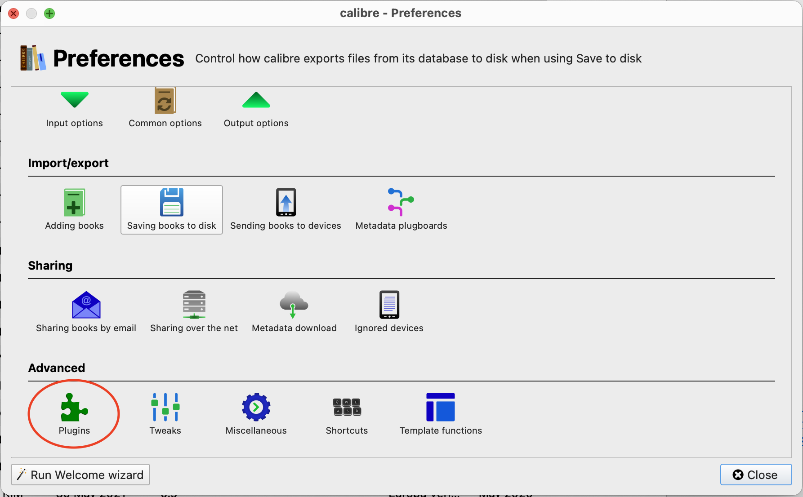
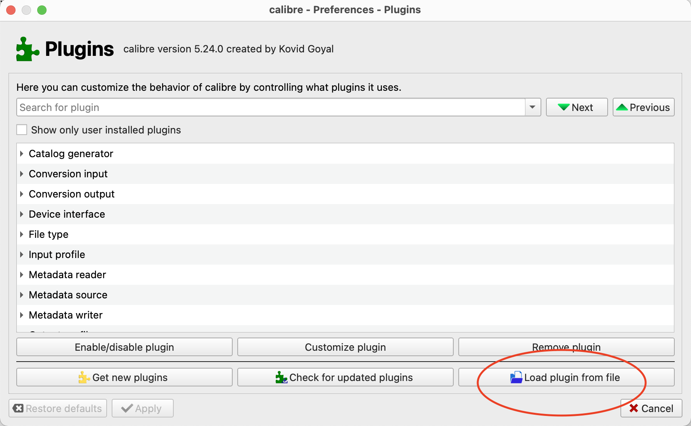
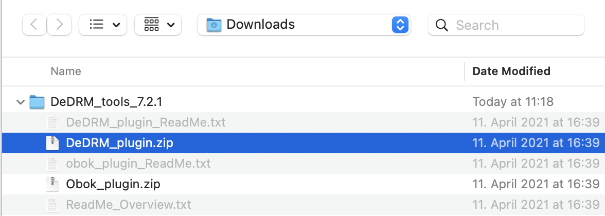
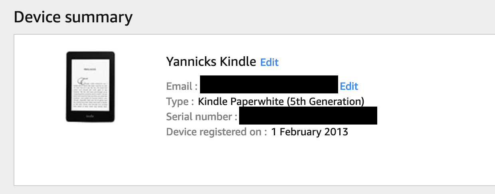
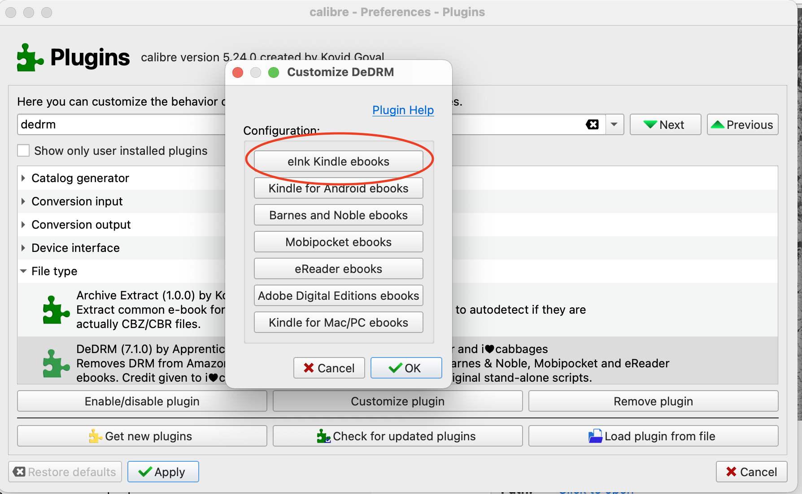
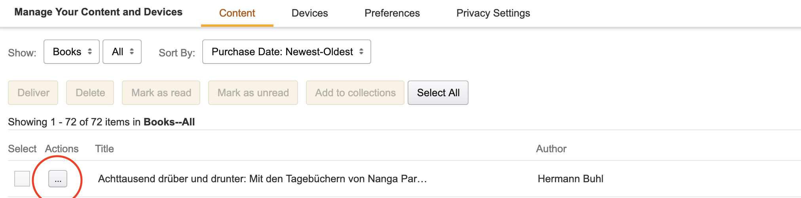

1. Install [calibre](https://calibre-ebook.com/)
2. Download the latest zip release from https://github.com/apprenticeharper/DeDRM_tools/releases and unzip the file
3. In Calibre open `preferences > plugins > Load plugin from file` and select `DeDRM_plugin.zip` from the unzipped folder
   
   
   
4. In Amazon go to `Your Account > Amazon Manage Your Content And Devices > Devices > Your Kindle` and copy the serial number
   
5. Put the serial number in calibre `Preferences > Plugins > DeDRM > Customize Plugin`
   
6. Download any book from your amazon library on amazon: `Your Account > Amazon Manage Your Content And Devices > Content` select the three `...` and click `Download and transfer via USB` and finally select your kindle from the dropdown.
   
7. Drag the book in the `AZW3` format into calibre and click convert book and convert to any format you like
