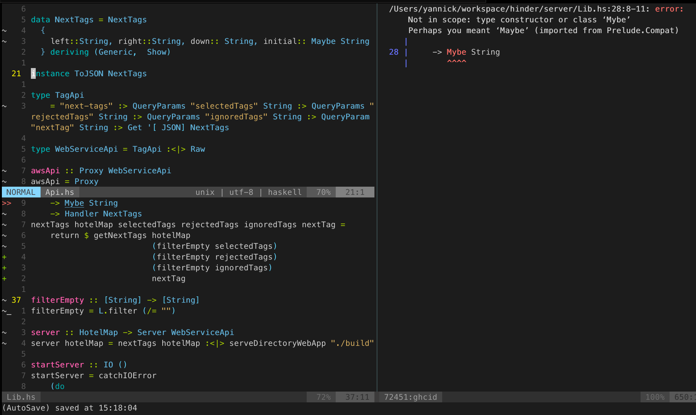

I really like the [zoom](https://sanctum.geek.nz/arabesque/zooming-tmux-panes/) feature of tmux. It allows to jump into any window in detail, if you 
have multiple split windows open at the same time. So if you want to have a closer look at a specific window it is very useful.

As I am using a lot of split windows in neovim as well, mostly to run something in a `:terminal` window, it would be great to have this zoom ability as well.

Zoom in and out in vim:



Unfortunately there is no build in feature like that, but there is a very easy workaround to create similar behavior.
We can take the tab splitting mechanics to emulate zoom. So for zooming in we run `:tab split`, creating a new tab with only the current window. To exit again we just call `:tab close`.

I put some keybindings to make toggling pretty intuitive:
```vim
" zoom features
nnoremap <leader>zi :tab split<CR>
nnoremap <leader>zo :tab close<CR>
```

Some drawbacks of that simple solution are:
  * no easy toggling, two commands
  * hitting `:tab close` when not in the zoomed in window closes the current tab, that can be disturbing
  * cursor position is not preserved when zooming out

### Zoom status in statusbar

I published my minimal zoom plugin, which also allow you to show the zoom state in the statusline.
You can check it out [here](https://github.com/yannick-cw/vimzoom)
